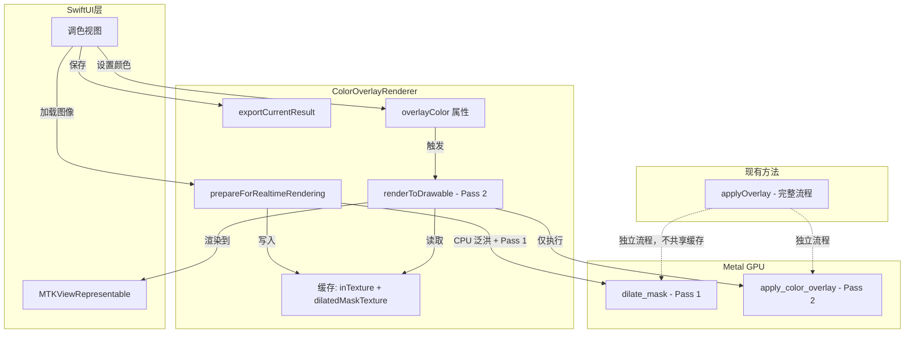
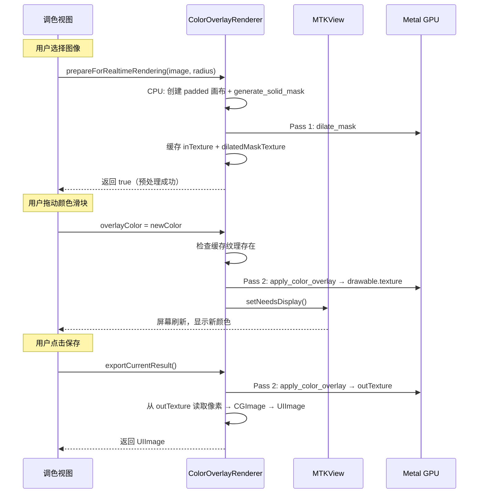

# 设计文档：颜色蒙版实时渲染预览

## 概述

本设计将 `ColorOverlayRenderer` 的渲染流程拆分为"预处理"和"实时渲染"两个阶段，实现用户调色时的实时预览能力。

当前 `applyOverlay` 方法每次调用都执行完整流程：CPU 泛洪填充 → GPU Pass 1（膨胀 Mask）→ GPU Pass 2（颜色叠加）→ 像素回读。其中 CPU 泛洪和 Pass 1 的结果只取决于图像内容和膨胀半径，与颜色无关，因此可以缓存复用。

新方案：
1. `prepareForRealtimeRendering` 一次性执行 CPU 泛洪 + Pass 1，缓存 `inTexture` 和 `dilatedMaskTexture`
2. `overlayColor` 属性变化时，仅重新执行 Pass 2（`apply_color_overlay`），渲染到 MTKView drawable
3. `exportCurrentResult` 在用户确认保存时，才从 `outTexture` 编码为 UIImage

### 设计决策

1. **MTKView 按需绘制模式**：设置 `isPaused = true` + `enableSetNeedsDisplay = true`，仅在颜色变化时手动触发 `setNeedsDisplay()`，避免 60fps 空转消耗电量。
2. **渲染目标选择**：实时预览直接渲染到 MTKView 的 `currentDrawable.texture`，避免额外的 blit 拷贝。导出时使用独立的 `outTexture` 确保像素可读。
3. **NSLock 而非 Actor**：`ColorOverlayRenderer` 已标记为 `@unchecked Sendable` 且是 singleton，使用 `NSLock` 保护缓存纹理的读写，与现有并发模型一致，避免引入 actor 隔离带来的 API 变更。
4. **保留 `applyOverlay` 完全独立**：新增的缓存属性和实时渲染逻辑不影响 `applyOverlay` 的执行路径，两者使用各自独立的纹理和 command buffer。
5. **MTKViewRepresentable 作为独立文件**：遵循项目 Domain 目录结构，放在 `Calendar/` 目录下，与 `ColorOverlayRenderer` 同级。

## 架构



### 数据流



## 组件与接口

### 1. ColorOverlayRenderer 扩展

在现有 `ColorOverlayRenderer` 中新增以下属性和方法：

```swift
@Observable
public class ColorOverlayRenderer: @unchecked Sendable {
    // === 现有属性保持不变 ===
    public static let shared = ColorOverlayRenderer()
    private var device: MTLDevice?
    private var commandQueue: MTLCommandQueue?
    private var dilatePipelineState: MTLComputePipelineState?
    private var applyOverlayPipelineState: MTLComputePipelineState?

    // === 新增：实时渲染缓存 ===
    private let realtimeLock = NSLock()
    private var cachedInTexture: MTLTexture?
    private var cachedDilatedMaskTexture: MTLTexture?
    private var cachedOutTexture: MTLTexture?
    private var cachedImageScale: CGFloat = 1.0
    private var cachedImageOrientation: UIImage.Orientation = .up
    private var isPrepared: Bool = false

    // === 新增：实时渲染触发 ===
    public var overlayColor: UIColor? {
        didSet {
            guard overlayColor != nil, isPrepared else { return }
            renderToView()
        }
    }

    /// MTKView 的弱引用，由 MTKViewRepresentable 设置
    weak var mtkView: MTKView?

    // === 新增方法 ===

    /// 预处理：执行 CPU 泛洪 + Pass 1 膨胀，缓存纹理
    /// - Returns: 预处理是否成功
    @discardableResult
    public func prepareForRealtimeRendering(
        image: UIImage,
        expandRadius: Int32 = 30
    ) -> Bool

    /// 仅执行 Pass 2，渲染到 MTKView drawable
    private func renderToView()

    /// 导出当前渲染结果为 UIImage
    public func exportCurrentResult() -> UIImage?

    /// 清理缓存纹理资源
    public func cleanupRealtimeCache()

    // === 现有方法保持不变 ===
    public func applyOverlay(to:color:expandRadius:) -> UIImage?
}
```

### 2. MTKViewRepresentable

新文件：`Source/Domain/Calendar/MTKViewRepresentable.swift`

```swift
import SwiftUI
import MetalKit

struct MTKViewRepresentable: UIViewRepresentable {
    let renderer: ColorOverlayRenderer

    func makeUIView(context: Context) -> MTKView {
        let mtkView = MTKView()
        mtkView.device = MTLCreateSystemDefaultDevice()
        mtkView.isPaused = true
        mtkView.enableSetNeedsDisplay = true
        mtkView.framebufferOnly = false
        mtkView.clearColor = MTLClearColor(red: 0, green: 0, blue: 0, alpha: 0)
        mtkView.isOpaque = false
        mtkView.delegate = context.coordinator
        renderer.mtkView = mtkView
        return mtkView
    }

    func updateUIView(_ uiView: MTKView, context: Context) {}

    static func dismantleUIView(_ uiView: MTKView, coordinator: Coordinator) {
        // 释放 Metal 资源引用
        uiView.delegate = nil
    }

    func makeCoordinator() -> Coordinator {
        Coordinator(renderer: renderer)
    }

    class Coordinator: NSObject, MTKViewDelegate {
        let renderer: ColorOverlayRenderer

        init(renderer: ColorOverlayRenderer)

        func mtkView(_ view: MTKView, drawableSizeWillChange size: CGSize) {}

        func draw(in view: MTKView) {
            // 由 renderer.renderToView() 内部处理实际渲染
            // 此回调在 setNeedsDisplay 触发时被调用
        }
    }
}
```

### 3. prepareForRealtimeRendering 实现要点

```swift
public func prepareForRealtimeRendering(image: UIImage, expandRadius: Int32 = 30) -> Bool {
    realtimeLock.lock()
    defer { realtimeLock.unlock() }

    // 1. 释放旧缓存
    cachedInTexture = nil
    cachedDilatedMaskTexture = nil
    cachedOutTexture = nil
    isPrepared = false

    guard let device, let commandQueue, let dilatePipelineState,
          let cgImage = image.cgImage else { return false }

    // 2. 创建 padded 画布（与 applyOverlay 相同逻辑）
    let padding = Int(expandRadius)
    let width = cgImage.width + padding * 2
    let height = cgImage.height + padding * 2
    // ... 提取像素、绘制到 padded 画布 ...

    // 3. CPU 泛洪生成基础 Mask
    // generate_solid_mask(imageData:width:height:maskData:)

    // 4. 创建 Metal 纹理
    // inTexture (rgba8Unorm), cpuMaskTexture (r8Unorm), dilatedMaskTexture (r8Unorm), outTexture (rgba8Unorm)

    // 5. GPU Pass 1: dilate_mask
    // 使用 commandBuffer + computeEncoder 执行膨胀

    // 6. 缓存结果
    cachedInTexture = inTexture
    cachedDilatedMaskTexture = dilatedMaskTexture
    cachedOutTexture = outTexture
    cachedImageScale = image.scale
    cachedImageOrientation = image.imageOrientation
    isPrepared = true

    return true
}
```

### 4. renderToView 实现要点

```swift
private func renderToView() {
    realtimeLock.lock()
    let inTex = cachedInTexture
    let maskTex = cachedDilatedMaskTexture
    let prepared = isPrepared
    let color = overlayColor
    realtimeLock.unlock()

    guard prepared, let inTex, let maskTex, let color,
          let commandQueue, let applyOverlayPipelineState,
          let mtkView, let drawable = mtkView.currentDrawable else { return }

    // 1. 提取颜色分量
    var r: CGFloat = 0, g: CGFloat = 0, b: CGFloat = 0, a: CGFloat = 0
    color.getRed(&r, green: &g, blue: &b, alpha: &a)
    var overlayParams = OverlayColor(color: SIMD4<Float>(Float(r), Float(g), Float(b), Float(a)))

    // 2. 创建 command buffer + encoder
    // 3. 执行 apply_color_overlay: inTex + maskTex → drawable.texture
    // 4. present(drawable) + commit
    // 注意：不调用 waitUntilCompleted，让 GPU 异步执行
}
```

## 数据模型

### 新增属性（ColorOverlayRenderer 内部）

| 属性 | 类型 | 说明 |
|------|------|------|
| `realtimeLock` | `NSLock` | 保护缓存纹理的读写同步 |
| `cachedInTexture` | `MTLTexture?` | 缓存的原始图像纹理（padded） |
| `cachedDilatedMaskTexture` | `MTLTexture?` | 缓存的膨胀后 Mask 纹理（Pass 1 输出） |
| `cachedOutTexture` | `MTLTexture?` | 用于导出的输出纹理 |
| `cachedImageScale` | `CGFloat` | 原始图像的 scale，导出时使用 |
| `cachedImageOrientation` | `UIImage.Orientation` | 原始图像的 orientation，导出时使用 |
| `isPrepared` | `Bool` | 预处理是否完成的标志 |
| `overlayColor` | `UIColor?` | 当前叠加颜色，修改时触发实时渲染 |
| `mtkView` | `MTKView?`（weak） | MTKView 的弱引用 |

### 文件位置

| 文件 | 路径 | 说明 |
|------|------|------|
| ColorOverlayRenderer.swift | `Source/Domain/Calendar/ColorOverlayRenderer.swift` | 修改：新增缓存属性和实时渲染方法 |
| MTKViewRepresentable.swift | `Source/Domain/Calendar/MTKViewRepresentable.swift` | 新增：SwiftUI Metal 视图包装 |
| Shaders.metal | `Source/Domain/Calendar/Shaders.metal` | 无需修改 |
| FloodPoint.swift | `Source/Domain/Calendar/FloodPoint.swift` | 无需修改 |


## 正确性属性（Correctness Properties）

*正确性属性是指在系统所有合法执行路径中都应成立的特征或行为——本质上是对系统应做什么的形式化陈述。属性是连接人类可读规格说明与机器可验证正确性保证之间的桥梁。*

### Property 1: 预处理缓存始终反映最后一次输入

*对于任意* 有效 UIImage 序列和 expandRadius 值，每次调用 `prepareForRealtimeRendering` 成功后，缓存的 `inTexture` 和 `dilatedMaskTexture` 应非 nil，且纹理尺寸应等于 `(originalWidth + 2 * expandRadius, originalHeight + 2 * expandRadius)`；若连续调用多次，最终缓存应仅反映最后一次调用的图像尺寸。

**Validates: Requirements 1.3, 1.4**

### Property 2: 未预处理状态下的操作防护

*对于任意* `overlayColor` 值和 `exportCurrentResult` 调用，若 `isPrepared == false`（未调用 `prepareForRealtimeRendering` 或调用了 `cleanupRealtimeCache`），则设置 `overlayColor` 不应触发渲染，且 `exportCurrentResult()` 应返回 nil。

**Validates: Requirements 2.3, 4.3**

### Property 3: 导出图像保留原始元数据

*对于任意* 有效 UIImage（具有任意 scale 和 orientation），经过 `prepareForRealtimeRendering` 和颜色渲染后，`exportCurrentResult()` 返回的 UIImage 的 `scale` 和 `imageOrientation` 应与原始输入图像一致。

**Validates: Requirements 4.2**

### Property 4: applyOverlay 与实时渲染缓存完全独立

*对于任意* 实时渲染缓存状态（无论是否已调用 `prepareForRealtimeRendering`、缓存了何种图像），调用 `applyOverlay(to:color:expandRadius:)` 的结果应仅取决于其输入参数，与缓存状态无关。

**Validates: Requirements 5.2**

## 错误处理

| 场景 | 处理方式 |
|------|----------|
| Metal 设备不可用 | `prepareForRealtimeRendering` 返回 `false`，`isPrepared` 保持 `false`，后续颜色变化被静默忽略 |
| 纹理创建失败（内存不足等） | 同上，返回 `false`，已部分创建的纹理被释放（通过 ARC） |
| 预处理未完成时设置 `overlayColor` | `didSet` 中检查 `isPrepared`，直接 return，不执行渲染 |
| 预处理未完成时调用 `exportCurrentResult` | 返回 `nil` |
| MTKView drawable 不可用 | `renderToView` 中 `guard let drawable` 失败，静默跳过本帧渲染 |
| `applyOverlay` 与实时渲染并发执行 | `NSLock` 保护缓存纹理读写；`applyOverlay` 使用独立的局部纹理，不访问缓存 |
| 连续快速颜色变化 | 每次 `didSet` 触发 `renderToView`，GPU command buffer 按提交顺序执行，最终画面反映最新颜色 |
| `cleanupRealtimeCache` 调用 | 在锁保护下将所有缓存纹理置 nil，`isPrepared` 设为 `false` |

## 测试策略

### 单元测试

单元测试用于验证具体示例、边界情况和集成点：

- **MTKView 配置验证**：创建 `MTKViewRepresentable`，验证 `isPaused == true`、`enableSetNeedsDisplay == true`、`framebufferOnly == false`（验收标准 3.2, 3.4）
- **dismantleUIView 清理**：验证 `dismantleUIView` 将 delegate 设为 nil（验收标准 3.5）
- **applyOverlay 向后兼容**：使用已知输入调用 `applyOverlay`，验证输出与修改前一致（验收标准 5.1）
- **Metal 设备不可用时的错误处理**：模拟设备为 nil，验证 `prepareForRealtimeRendering` 返回 false（验收标准 1.5）

### 属性测试（Property-Based Testing）

使用 SwiftCheck 或手写随机生成器进行属性测试。每个属性测试至少运行 100 次迭代。

由于 Metal GPU 操作无法在纯单元测试环境中执行，属性测试将聚焦于可 mock 的逻辑层：

- **Property 1 测试**：生成随机图像尺寸（width, height）和 expandRadius 值序列，使用 mock Metal device，验证每次 prepare 后缓存纹理的尺寸 = (width + 2*radius, height + 2*radius)，且多次调用后仅保留最后一次的尺寸
  - Tag: `Feature: color-overlay-realtime-render, Property 1: preparation cache reflects last input`
- **Property 2 测试**：生成随机 UIColor 值，在未调用 prepare 的状态下设置 overlayColor 和调用 exportCurrentResult，验证无渲染触发且返回 nil
  - Tag: `Feature: color-overlay-realtime-render, Property 2: unprepared state guards`
- **Property 3 测试**：生成随机 image scale（1x, 2x, 3x）和 orientation 值，执行 prepare + render + export 流程，验证导出图像的 scale 和 orientation 与输入一致
  - Tag: `Feature: color-overlay-realtime-render, Property 3: export preserves image metadata`
- **Property 4 测试**：生成随机缓存状态（prepared/unprepared，不同图像尺寸），对同一输入调用 applyOverlay，验证输出像素数据一致
  - Tag: `Feature: color-overlay-realtime-render, Property 4: applyOverlay independent of cache`

### 集成测试

- **完整预处理 + 渲染流程**：使用真实 Metal 设备，加载测试图像，调用 prepare → 设置颜色 → 验证 MTKView drawable 被 present（验收标准 1.2, 2.2, 2.4）
- **并发安全**：从多个线程同时调用 prepareForRealtimeRendering、设置 overlayColor、调用 applyOverlay，验证无崩溃（验收标准 6.1, 6.2, 6.3）
- **连续快速颜色变化**：快速设置 100 次不同颜色，验证最终渲染结果反映最后一次颜色（验收标准 2.5）

每个正确性属性由一个属性测试实现。属性测试与单元测试互补：单元测试捕获具体 bug，属性测试验证通用正确性。
