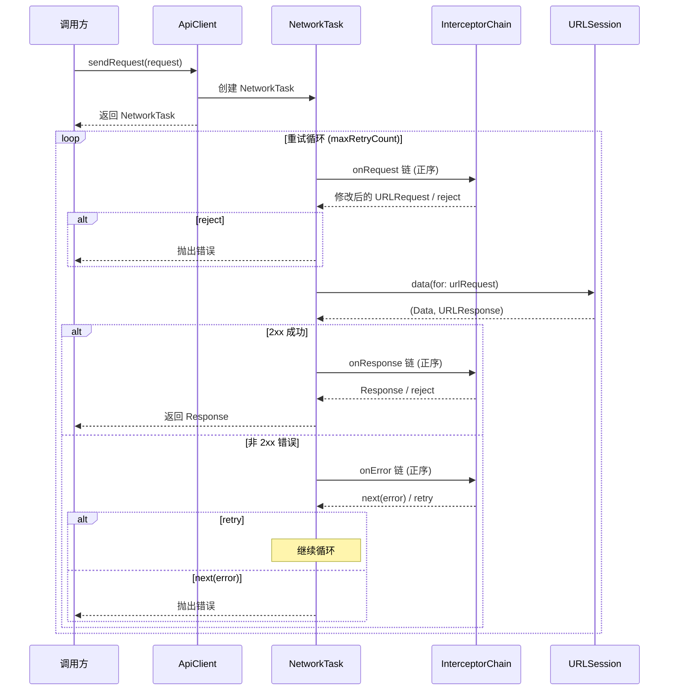
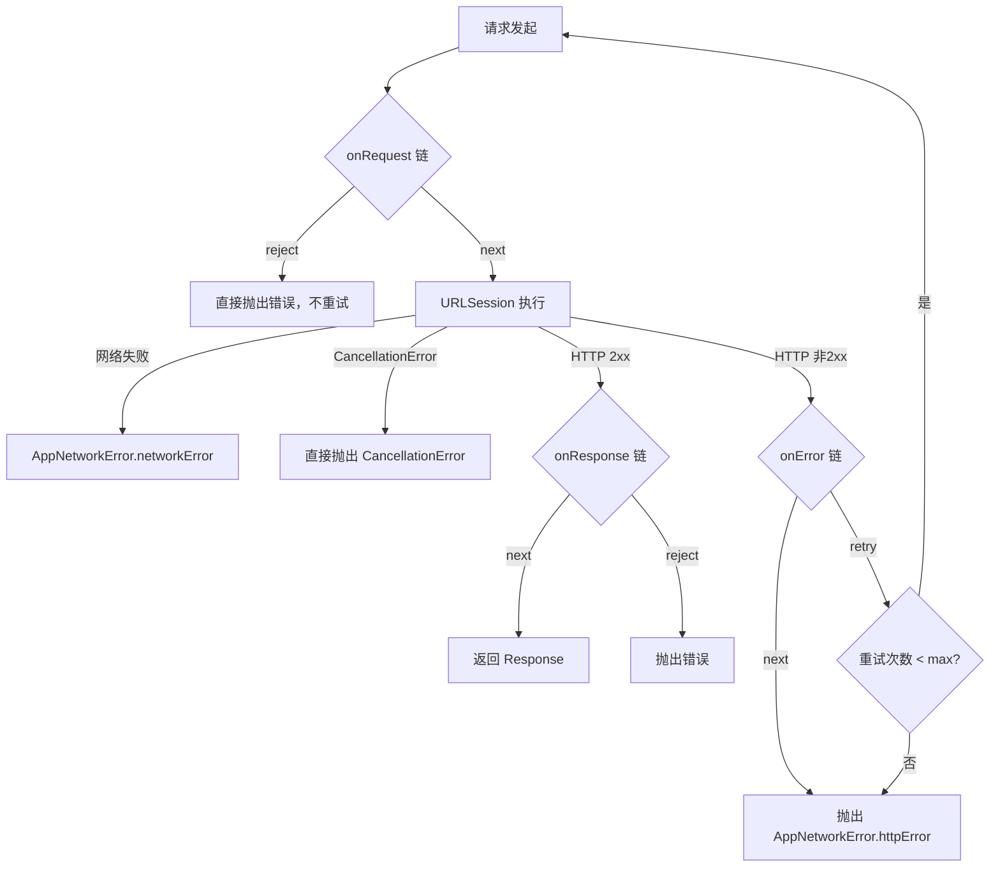

# 设计文档：Network ApiClient 优化

## 概述

本设计对 LTNetwork 框架的 `ApiClient` 进行三项核心重构：

1. **请求生命周期管理**：引入 `NetworkTask` 句柄，使调用方可以取消进行中的请求
2. **迭代重试机制**：将递归 `sendRequest` 替换为 `while` 循环，消除栈溢出风险
3. **Dio 风格拦截器接口**：用 `onRequest`/`onResponse`/`onError` + Handler 模式替代现有的 `adapt`/`shouldRetry`/`abort` 接口

### 设计决策与理由

| 决策 | 理由 |
|------|------|
| `NetworkTask` 包装 `Task<Response, Error>` | 利用 Swift Concurrency 原生取消机制，无需自行管理状态 |
| 迭代 while 循环 + `maxRetryCount` | 避免递归栈增长，重试逻辑集中在一处，易于调试 |
| Handler 使用 enum 返回值而非回调 | Swift async/await 下 enum 返回值比闭包回调更简洁、类型安全 |
| 拦截器链正序执行 onRequest/onResponse/onError | 简化心智模型，与 Dio 保持一致 |
| 统一 `[NetworkInterceptor]` 数组 | 消除多类型数组的复杂性，拦截器按注册顺序执行 |

## 架构

### 整体请求流程



### 模块结构

```
core/Network/Source/
├── ApiClient.swift                    # 重构：迭代重试 + NetworkTask
├── RequestBuilder.swift               # 不变
├── Interceptor/
│   ├── NetworkInterceptor.swift       # 重构：新协议定义
│   ├── InterceptorHandler.swift       # 新增：Handler 类型定义
│   └── InterceptorChain.swift         # 新增：链式执行引擎
├── Model/
│   ├── NetworkTask.swift              # 新增：请求句柄
│   ├── Request.swift                  # 不变
│   ├── Response.swift                 # 不变
│   ├── AppNetworkError.swift          # 不变
│   ├── Environment.swift              # 不变
│   └── Encoder.swift                  # 不变

app/LTApp/LTApp/Source/Service/Interceptor/
├── AuthInterceptor.swift              # 迁移：onRequest
├── RefreshTokenInterceptor.swift      # 迁移：onError + retry
├── LogoutInterceptor.swift            # 迁移：onError + next
```

## 组件与接口

### 1. NetworkInterceptor 协议（重构）

替代现有的 `adapt`/`shouldRetry`/`abort` 三方法协议。

```swift
public protocol NetworkInterceptor: Sendable {
    func onRequest(_ request: URLRequest, handler: RequestInterceptorHandler) async -> RequestInterceptorResult
    func onResponse(_ response: Response, handler: ResponseInterceptorHandler) async -> ResponseInterceptorResult
    func onError(_ error: Error, request: URLRequest, handler: ErrorInterceptorHandler) async -> ErrorInterceptorResult
}

// 默认实现：透传
extension NetworkInterceptor {
    public func onRequest(_ request: URLRequest, handler: RequestInterceptorHandler) async -> RequestInterceptorResult {
        handler.next(request)
    }
    public func onResponse(_ response: Response, handler: ResponseInterceptorHandler) async -> ResponseInterceptorResult {
        handler.next(response)
    }
    public func onError(_ error: Error, request: URLRequest, handler: ErrorInterceptorHandler) async -> ErrorInterceptorResult {
        handler.next(error)
    }
}
```

### 2. InterceptorHandler 类型

Handler 不使用闭包回调，而是返回 enum 值，由 `InterceptorChain` 解释执行。

```swift
// MARK: - Request Phase
public struct RequestInterceptorHandler: Sendable {
    public func next(_ request: URLRequest) -> RequestInterceptorResult { .next(request) }
    public func reject(_ error: Error) -> RequestInterceptorResult { .reject(error) }
}

public enum RequestInterceptorResult: Sendable {
    case next(URLRequest)
    case reject(Error)
}

// MARK: - Response Phase
public struct ResponseInterceptorHandler: Sendable {
    public func next(_ response: Response) -> ResponseInterceptorResult { .next(response) }
    public func reject(_ error: Error) -> ResponseInterceptorResult { .reject(error) }
}

public enum ResponseInterceptorResult: Sendable {
    case next(Response)
    case reject(Error)
}

// MARK: - Error Phase
public struct ErrorInterceptorHandler: Sendable {
    public func next(_ error: Error) -> ErrorInterceptorResult { .next(error) }
    public func retry() -> ErrorInterceptorResult { .retry }
}

public enum ErrorInterceptorResult: Sendable {
    case next(Error)
    case retry
}
```

### 3. InterceptorChain

负责按注册顺序执行拦截器链，返回最终结果。

```swift
struct InterceptorChain: Sendable {
    let interceptors: [NetworkInterceptor]

    func executeOnRequest(_ request: URLRequest) async -> RequestInterceptorResult {
        var current = request
        let handler = RequestInterceptorHandler()
        for interceptor in interceptors {
            let result = await interceptor.onRequest(current, handler: handler)
            switch result {
            case .next(let modified):
                current = modified
            case .reject(let error):
                return .reject(error)
            }
        }
        return .next(current)
    }

    func executeOnResponse(_ response: Response) async -> ResponseInterceptorResult {
        var current = response
        let handler = ResponseInterceptorHandler()
        for interceptor in interceptors {
            let result = await interceptor.onResponse(current, handler: handler)
            switch result {
            case .next(let modified):
                current = modified
            case .reject(let error):
                return .reject(error)
            }
        }
        return .next(current)
    }

    func executeOnError(_ error: Error, request: URLRequest) async -> ErrorInterceptorResult {
        var currentError = error
        let handler = ErrorInterceptorHandler()
        for interceptor in interceptors {
            let result = await interceptor.onError(currentError, request: request, handler: handler)
            switch result {
            case .next(let modified):
                currentError = modified
            case .retry:
                return .retry
            }
        }
        return .next(currentError)
    }
}
```

### 4. NetworkTask

请求生命周期句柄，包装 Swift `Task` 并暴露取消和结果获取能力。

```swift
public final class NetworkTask: Sendable {
    private let task: Task<Response, Error>

    init(task: Task<Response, Error>) {
        self.task = task
    }

    public var value: Response {
        get async throws { try await task.value }
    }

    public func cancel() {
        task.cancel()
    }

    public var isCancelled: Bool {
        task.isCancelled
    }
}
```

### 5. ApiClient（重构）

核心变更：迭代重试循环 + InterceptorChain + NetworkTask。

```swift
public class ApiClient: ApiClientType, @unchecked Sendable {
    private let session: URLSession
    private let environment: AppEnvironment
    private let interceptors: [NetworkInterceptor]
    private let chain: InterceptorChain
    private let maxRetryCount: Int

    public init(
        configuration: URLSessionConfiguration = .default,
        environment: AppEnvironment,
        interceptors: [NetworkInterceptor],
        maxRetryCount: Int = 2
    ) {
        self.session = URLSession(configuration: configuration)
        self.environment = environment
        self.interceptors = interceptors
        self.chain = InterceptorChain(interceptors: interceptors)
        self.maxRetryCount = maxRetryCount
    }

    // 便捷方法：保持现有接口
    public func sendRequest(_ request: any Request) async throws -> Response {
        let networkTask = makeTask(for: request)
        return try await networkTask.value
    }

    // 返回可控制的 NetworkTask
    public func request(_ request: any Request) -> NetworkTask {
        makeTask(for: request)
    }

    private func makeTask(for request: any Request) -> NetworkTask {
        let task = Task<Response, Error> {
            try await executeWithRetry(request)
        }
        return NetworkTask(task: task)
    }

    private func executeWithRetry(_ request: any Request) async throws -> Response {
        let builder = RequestBuilder(request: request)
        let baseRequest = builder.build(environment)
        var retryCount = 0

        while true {
            // 检查取消
            try Task.checkCancellation()

            // 1. onRequest 拦截器链
            let requestResult = await chain.executeOnRequest(baseRequest)
            let urlRequest: URLRequest
            switch requestResult {
            case .next(let req): urlRequest = req
            case .reject(let error): throw error
            }

            // 2. 执行网络请求
            try Task.checkCancellation()
            let responseData: (Data, URLResponse)
            do {
                responseData = try await session.data(for: urlRequest)
            } catch {
                if error is CancellationError { throw error }
                throw AppNetworkError.networkError(
                    debugDescription: error.localizedDescription,
                    errorCode: (error as? URLError)?.code
                )
            }

            guard let httpResponse = responseData.1 as? HTTPURLResponse else {
                throw AppNetworkError.dataError(debugDescription: "Data error")
            }
            let statusCode = httpResponse.statusCode

            // 3. 处理响应
            switch statusCode {
            case 200..<300:
                let response = Response(statusCode: statusCode, data: responseData.0)
                let responseResult = await chain.executeOnResponse(response)
                switch responseResult {
                case .next(let res): return res
                case .reject(let error): throw error
                }
            default:
                let error = AppNetworkError.httpError(
                    statusCode: HttpErrorCode(rawValue: statusCode) ?? .badRequest,
                    body: responseData.0
                )
                // 4. onError 拦截器链
                let errorResult = await chain.executeOnError(error, request: urlRequest)
                switch errorResult {
                case .next(let finalError): throw finalError
                case .retry:
                    retryCount += 1
                    if retryCount >= maxRetryCount {
                        throw error
                    }
                    continue // 重新进入循环
                }
            }
        }
    }
}
```

### 6. 迁移后的拦截器

#### AuthInterceptor（仅覆写 onRequest）

```swift
public actor AuthInterceptor: NetworkInterceptor, @unchecked Sendable {
    private weak var tokenProvider: TokenProvider?

    init(tokenProvider: TokenProvider?) {
        self.tokenProvider = tokenProvider
    }

    public func onRequest(_ request: URLRequest, handler: RequestInterceptorHandler) async -> RequestInterceptorResult {
        var request = request
        if let token = tokenProvider?.accessToken {
            request.setValue("Bearer \(token)", forHTTPHeaderField: "Authorization")
        }
        return handler.next(request)
    }
}
```

#### RefreshTokenInterceptor（仅覆写 onError）

```swift
actor RefreshTokenInterceptor: NetworkInterceptor, @unchecked Sendable {
    private weak var tokenProvider: TokenProvider?
    private let service: any AppDataWithoutAuthorizationServicefull
    private var refreshingTask: Task<Void, Error>?

    init(tokenProvider: TokenProvider?, service: any AppDataWithoutAuthorizationServicefull) {
        self.tokenProvider = tokenProvider
        self.service = service
    }

    public func onError(_ error: Error, request: URLRequest, handler: ErrorInterceptorHandler) async -> ErrorInterceptorResult {
        guard let networkError = error as? AppNetworkError,
              case .httpError(statusCode: .unauthorized, _) = networkError else {
            return handler.next(error)
        }
        do {
            try await refreshTokenIfNeeded()
            return handler.retry()
        } catch {
            return handler.next(error)
        }
    }

    private func refreshTokenIfNeeded() async throws {
        if let existingTask = refreshingTask {
            return try await existingTask.value
        }
        let task = Task {
            defer { refreshingTask = nil }
            try await service.refreshTokenUseCase.execute()
        }
        refreshingTask = task
        try await task.value
    }
}
```

#### LogoutInterceptor（仅覆写 onError）

```swift
public class LogoutInterceptor: NetworkInterceptor, TokenExpirePublihser, @unchecked Sendable {
    private weak var tokenProvider: TokenProvider?
    private var tokenExpiredSubject: PassthroughSubject<Void, Never>

    public var expired: AnyPublisher<Void, Never> {
        tokenExpiredSubject.eraseToAnyPublisher()
    }

    public init(tokenProvider: TokenProvider?) {
        self.tokenProvider = tokenProvider
        tokenExpiredSubject = .init()
    }

    public func onError(_ error: Error, request: URLRequest, handler: ErrorInterceptorHandler) async -> ErrorInterceptorResult {
        // 仅在令牌刷新失败后处理（由 RefreshTokenInterceptor 传递过来的错误）
        guard let networkError = error as? AppNetworkError,
              case .httpError(statusCode: .unauthorized, _) = networkError else {
            return handler.next(error)
        }
        tokenProvider?.clear()
        tokenExpiredSubject.send()
        return handler.next(error)
    }
}
```

### 7. SSE 流式请求支持

`sendSSERequest` 同样通过 `NetworkTask` 提供取消能力，内部使用 `InterceptorChain.executeOnRequest` 执行拦截器链。

```swift
// ApiClient 扩展
public func sendSSERequest<T: Codable & Sendable>(_ request: any Request) -> (stream: AsyncThrowingStream<T, any Error>, task: NetworkTask) {
    let innerTask = Task<Response, Error> { /* placeholder for cancellation tracking */ }
    // 实际实现通过 continuation.onTermination 取消底层 Task
    // ...
}
```

## 数据模型

### 新增类型

| 类型 | 位置 | 说明 |
|------|------|------|
| `NetworkTask` | `core/Network/Source/Model/NetworkTask.swift` | 请求生命周期句柄，包装 `Task<Response, Error>` |
| `RequestInterceptorHandler` | `core/Network/Source/Interceptor/InterceptorHandler.swift` | onRequest 阶段的 handler |
| `ResponseInterceptorHandler` | 同上 | onResponse 阶段的 handler |
| `ErrorInterceptorHandler` | 同上 | onError 阶段的 handler |
| `RequestInterceptorResult` | 同上 | onRequest 返回值枚举：`.next(URLRequest)` / `.reject(Error)` |
| `ResponseInterceptorResult` | 同上 | onResponse 返回值枚举：`.next(Response)` / `.reject(Error)` |
| `ErrorInterceptorResult` | 同上 | onError 返回值枚举：`.next(Error)` / `.retry` |
| `InterceptorChain` | `core/Network/Source/Interceptor/InterceptorChain.swift` | 拦截器链执行引擎 |

### 修改类型

| 类型 | 变更 |
|------|------|
| `NetworkInterceptor` | 协议方法从 `adapt`/`shouldRetry`/`abort` 改为 `onRequest`/`onResponse`/`onError` |
| `ApiClient` | 新增 `request(_:) -> NetworkTask` 方法，`sendRequest` 内部委托给 `NetworkTask`，重试逻辑改为迭代 |
| `ApiClientType` | 协议不变，`sendRequest` 签名保持兼容 |

### 不变类型

`Request`、`Response`、`AppNetworkError`、`HttpErrorCode`、`ErrorModel`、`RequestBuilder`、`AppEnvironment` 均不修改。


## 正确性属性

*属性（Property）是指在系统所有合法执行中都应成立的特征或行为——本质上是对系统应做什么的形式化陈述。属性是人类可读规格说明与机器可验证正确性保证之间的桥梁。*

### Property 1: 取消操作产生 CancellationError

*For any* 网络请求，如果在请求完成前对其 NetworkTask 调用 cancel()，则 await 其 value 应抛出 CancellationError，且拦截器链不应继续执行。

**Validates: Requirements 1.2, 1.3, 2.5, 5.4**

### Property 2: sendRequest 与 NetworkTask.value 等价

*For any* 网络请求和相同的服务端响应，`sendRequest(request)` 的返回值应与 `request(request).value` 的返回值相同（相同的 statusCode 和 data）。

**Validates: Requirements 1.4**

### Property 3: 重试次数受最大上限约束

*For any* 始终返回错误且拦截器始终请求重试的请求，实际网络调用次数应等于 `maxRetryCount + 1`（1 次初始 + maxRetryCount 次重试），且最终抛出的错误应为最后一次请求的错误。

**Validates: Requirements 2.2, 2.4**

### Property 4: 重试时重新执行 onRequest 拦截器链

*For any* 触发重试的请求，每次重试都应重新执行完整的 onRequest 拦截器链。若 onRequest 拦截器被调用 N 次，则网络请求也应被执行 N 次。

**Validates: Requirements 2.3, 2.6, 3.8**

### Property 5: 默认拦截器透传

*For any* 仅使用默认实现（不覆写任何方法）的 NetworkInterceptor，请求、响应和错误应原样通过，不被修改。

**Validates: Requirements 3.5**

### Property 6: 拦截器按注册顺序执行

*For any* 拦截器数组，onRequest 阶段的执行顺序应与数组注册顺序一致，onResponse 和 onError 阶段同样按正序执行。

**Validates: Requirements 3.6**

### Property 7: AuthInterceptor 添加 Bearer 认证头

*For any* URLRequest 和非空 accessToken，经过 AuthInterceptor.onRequest 处理后，请求的 Authorization 头应为 `"Bearer {token}"`。若 token 为 nil，则请求不应包含 Authorization 头。

**Validates: Requirements 4.1**

### Property 8: RefreshTokenInterceptor 的 401 处理

*For any* AppNetworkError.httpError(statusCode: .unauthorized, _) 错误，RefreshTokenInterceptor 应尝试刷新令牌：若刷新成功则返回 `.retry`，若刷新失败则返回 `.next(error)` 传递错误。*For any* 非 401 错误，应直接返回 `.next(error)`。

**Validates: Requirements 4.2, 4.5**

### Property 9: LogoutInterceptor 清除令牌并发布过期事件

*For any* AppNetworkError.httpError(statusCode: .unauthorized, _) 错误传递到 LogoutInterceptor，它应清除 tokenProvider 中的令牌并通过 tokenExpiredSubject 发布过期事件，然后返回 `.next(error)`。

**Validates: Requirements 4.3**

### Property 10: 并发刷新令牌去重

*For any* N 个并发的 401 错误同时到达 RefreshTokenInterceptor，refreshTokenUseCase.execute() 应仅被调用 1 次，所有并发调用应共享同一个刷新结果。

**Validates: Requirements 4.4**

### Property 11: HTTP 状态码决定结果类型

*For any* HTTP 响应，若状态码在 200..<300 范围内，则返回 Response 对象；若状态码不在此范围内（且无拦截器重试），则抛出 AppNetworkError.httpError，其中包含对应的状态码和响应体。

**Validates: Requirements 5.1, 5.2**

### Property 12: 网络连接失败映射为 networkError

*For any* URLSession 网络连接失败（非取消），ApiClient 应抛出 AppNetworkError.networkError，包含调试描述和 URLError 错误码。

**Validates: Requirements 5.3**

### Property 13: onRequest 拒绝绕过重试

*For any* 在 onRequest 阶段被拦截器 reject 的请求，该错误应直接传播给调用方，不经过 onError 拦截器链，不触发重试逻辑。

**Validates: Requirements 5.5**

## 错误处理

### 错误传播路径



### 错误类型映射

| 场景 | 错误类型 | 说明 |
|------|----------|------|
| HTTP 非 2xx | `AppNetworkError.httpError(statusCode:body:)` | 与现有行为一致 |
| 网络连接失败 | `AppNetworkError.networkError(debugDescription:errorCode:)` | 包装 URLError |
| 请求取消 | `CancellationError` | Swift 原生取消错误 |
| onRequest 拦截器拒绝 | 拦截器抛出的原始错误 | 直接传播，不包装 |
| 响应数据异常 | `AppNetworkError.dataError(debugDescription:)` | HTTPURLResponse 转换失败 |

### 关键约束

- `CancellationError` 不经过 onError 拦截器链，直接抛出
- onRequest 阶段的 reject 不触发重试，直接传播
- 重试耗尽后抛出最后一次的 `AppNetworkError.httpError`
- 所有错误类型与现有 `AppNetworkError` 枚举保持一致，上层业务代码无需修改

## 测试策略

### 双重测试方法

本设计采用单元测试与属性测试互补的策略：

- **单元测试**：验证具体示例、边界条件和集成点
- **属性测试**：验证跨所有输入的通用属性

### 属性测试配置

- 使用 [SwiftCheck](https://github.com/typelift/SwiftCheck) 作为属性测试库
- 每个属性测试最少运行 100 次迭代
- 每个测试用注释标注对应的设计属性
- 标注格式：**Feature: network-apiclient-optimization, Property {number}: {property_text}**
- 每个正确性属性由一个属性测试实现

### 单元测试覆盖

| 测试类别 | 覆盖内容 |
|----------|----------|
| NetworkTask 生命周期 | 创建、取消、完成后取消（边界条件） |
| 拦截器链执行 | 空链、单拦截器、多拦截器顺序 |
| 重试机制 | 单次重试、达到上限、取消中断重试 |
| AuthInterceptor | 有 token、无 token、token 为 nil |
| RefreshTokenInterceptor | 401 刷新成功、刷新失败、非 401 透传、并发去重 |
| LogoutInterceptor | 401 清除令牌、非 401 透传 |
| 错误映射 | 各 HTTP 状态码、网络错误、取消错误 |
| SSE 流式请求 | 取消终止流、拦截器链执行 |

### 属性测试覆盖

| 属性 | 测试描述 | 生成器 |
|------|----------|--------|
| Property 1 | 取消产生 CancellationError | 随机 Request + 随机延迟 |
| Property 2 | sendRequest 与 NetworkTask.value 等价 | 随机 Request + Mock URLSession |
| Property 3 | 重试次数受上限约束 | 随机 maxRetryCount (1-5) + 始终失败的 Mock |
| Property 4 | 重试重新执行 onRequest 链 | 随机重试次数 + 计数拦截器 |
| Property 5 | 默认拦截器透传 | 随机 URLRequest / Response / Error |
| Property 6 | 拦截器执行顺序 | 随机排列的标记拦截器 |
| Property 7 | AuthInterceptor 添加 Bearer 头 | 随机 URLRequest + 随机 token 字符串 |
| Property 8 | RefreshTokenInterceptor 401 处理 | 随机 Error 类型（401 vs 非 401）+ 刷新成功/失败 |
| Property 9 | LogoutInterceptor 清除令牌 | 随机 401 错误 |
| Property 10 | 并发刷新去重 | 随机并发数 (2-10) + Mock 刷新延迟 |
| Property 11 | 状态码决定结果类型 | 随机 HTTP 状态码 (100-599) |
| Property 12 | 网络失败映射 | 随机 URLError.Code |
| Property 13 | onRequest reject 绕过重试 | 随机错误 + reject 拦截器 |

### Mock 依赖

测试需要以下 Mock 对象：

- `MockURLSession`：可配置返回值的 URLSession 替代，支持注入响应数据和错误
- `MockNetworkInterceptor`：记录调用次数和参数的拦截器，可配置返回行为
- `MockTokenProvider`：可配置 token 值的 TokenProvider
- `MockRefreshTokenUseCase`：可配置成功/失败和延迟的刷新用例（已存在于测试代码中）
