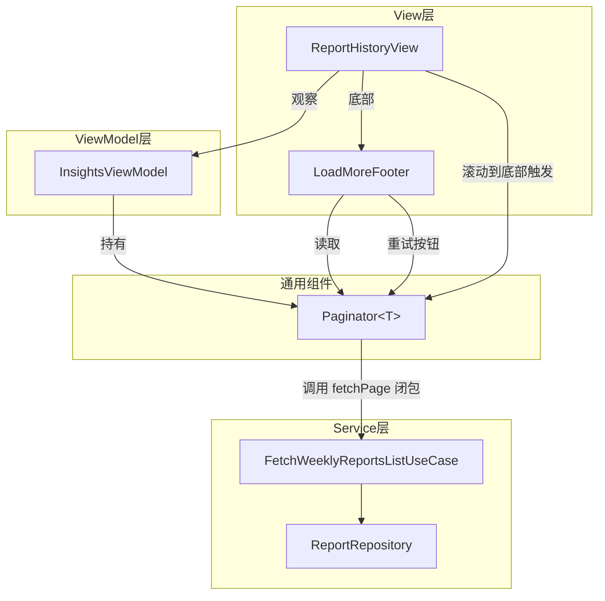
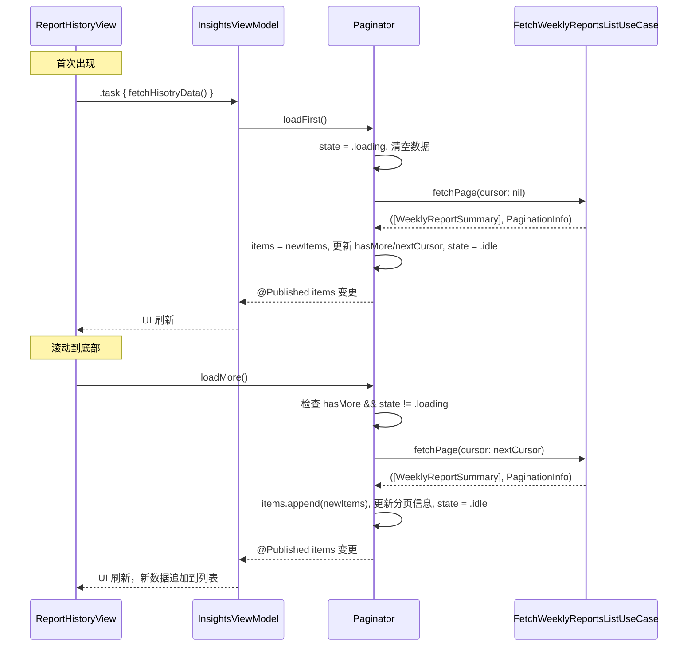

# 设计文档：分页加载更多

## 概述

本设计为 App 提供通用的 cursor 分页加载更多机制。核心是一个泛型的 `Paginator` 类，封装 cursor 分页的状态管理（首次加载、加载更多、刷新、防重复请求、错误处理），可被任意列表 ViewModel 复用。同时提供一个通用的 `LoadMoreFooter` SwiftUI 视图组件，用于展示加载中、无更多数据、错误重试等状态。

首先在 `InsightsViewModel` + `ReportHistoryView`（周报历史列表）中集成，后续可直接复用到 `ThreadView` 等其他列表。

### 设计决策

1. **Paginator 作为独立的 `@Observable` 类而非 ViewModel 基类**：采用组合而非继承，让现有 ViewModel（如 `InsightsViewModel`）通过持有 `Paginator` 实例来获得分页能力，避免破坏现有类层次结构。
2. **Paginator 使用 `@MainActor`**：因为它持有 `@Published` 属性驱动 UI 更新，所有状态变更必须在主线程，与项目中 ViewModel 的惯例一致。
3. **加载闭包注入**：Paginator 通过构造时注入的 `fetchPage` 闭包获取数据，不依赖具体 UseCase 或 Repository，保持泛型可复用性。
4. **复用现有 `PaginationInfo` 模型**：后端分页元数据已有 `PaginationInfo` 结构体（`limit`、`hasMore`、`nextCursor`），Paginator 直接使用它，无需新建分页模型。

## 架构



### 数据流



## 组件与接口

### 1. Paginator&lt;T&gt;

泛型分页状态管理器，位于 `Source/Common/Paginator.swift`。

```swift
/// 分页加载状态
enum PaginationState: Equatable {
    case idle
    case loading
    case error(String)
}

/// 加载更多 Footer 的显示状态
enum LoadMoreState: Equatable {
    case idle
    case loading
    case noMore
    case error(String)
}

@MainActor
final class Paginator<T: Sendable>: ObservableObject {
    typealias FetchPage = (_ cursor: String?) async throws -> ([T], PaginationInfo)

    @Published private(set) var items: [T] = []
    @Published private(set) var state: PaginationState = .idle
    @Published private(set) var hasMore: Bool = true

    private var nextCursor: String?
    private let fetchPage: FetchPage

    init(fetchPage: @escaping FetchPage)

    /// 清空数据，从第一页开始加载
    func loadFirst() async

    /// 使用 nextCursor 加载下一页，追加到已有数据
    func loadMore() async

    /// 计算 LoadMoreFooter 应显示的状态
    var loadMoreState: LoadMoreState { get }
}
```

**关键行为**：
- `loadFirst()`：将 `state` 设为 `.loading`，清空 `items`，以 `cursor: nil` 调用 `fetchPage`，成功后替换 `items` 并更新 `hasMore`/`nextCursor`
- `loadMore()`：若 `hasMore == false` 或 `state == .loading` 则直接返回；否则设 `state = .loading`，以 `nextCursor` 调用 `fetchPage`，成功后追加 `items`
- 失败时 `state = .error(message)`，已有 `items` 保持不变
- `loadMoreState` 是一个计算属性，根据 `state`、`hasMore`、`items.isEmpty` 推导出 Footer 应显示的状态

### 2. LoadMoreFooter

通用加载更多 Footer 视图，位于 `Source/Common/LoadMoreFooter.swift`。

```swift
struct LoadMoreFooter: View {
    let state: LoadMoreState
    let onRetry: () async -> Void

    var body: some View {
        // state == .idle     → EmptyView
        // state == .loading  → ProgressView 居中
        // state == .noMore   → "没有更多数据" 文案
        // state == .error    → 错误文案 + 重试按钮
    }
}
```

### 3. InsightsViewModel 集成

修改现有 `InsightsViewModel`，新增 `Paginator<WeeklyReportSummary>` 实例：

```swift
final class InsightsViewModel: ObservableObject, @unchecked Sendable {
    // 新增
    @MainActor @Published var reportsPaginator: Paginator<WeeklyReportSummary>!

    init(dataService: any AppDataWithAuthorizationServiceful) {
        self.dataService = dataService
        // 在 init 中初始化 paginator，注入 fetchPage 闭包
        self.reportsPaginator = Paginator { [dataService] cursor in
            let list = try await dataService.fetchWeeklyReportsListUseCase
                .execute(limit: 20, cursor: cursor, isRead: nil)
            return (list.reports, list.pagination)
        }
    }

    // 修改 fetchHisotryData，改用 paginator
    func fetchHisotryData() async throws {
        let currentIcons = try await dataService.fetchWeeklyReportCurrentIconsUseCase.execute()
        await reportsPaginator.loadFirst()
        await MainActor.run {
            // 更新 icons 相关状态...
            self.currentIcons = currentIcons
            // 从 paginator.items 分离 unread/read
            self.unreadHisotrys = reportsPaginator.items.filter { $0.readAt == nil }
            self.readHisotrys = reportsPaginator.items.filter { $0.readAt != nil }
        }
    }

    // 新增：加载更多后更新分组
    @MainActor
    func loadMoreHistory() async {
        await reportsPaginator.loadMore()
        self.unreadHisotrys = reportsPaginator.items.filter { $0.readAt == nil }
        self.readHisotrys = reportsPaginator.items.filter { $0.readAt != nil }
    }
}
```

### 4. ReportHistoryView 集成

修改 `ReportHistoryView`，在列表底部添加 `LoadMoreFooter`，并在滚动到底部时触发加载：

```swift
struct ReportHistoryView: View {
    @ObservedObject var viewModel: InsightsViewModel

    var body: some View {
        ScrollView {
            VStack(spacing: .zero) {
                ReportHistoryHeader(viewModel: viewModel)
                histroyView

                // 底部加载更多
                LoadMoreFooter(
                    state: viewModel.reportsPaginator.loadMoreState,
                    onRetry: { await viewModel.loadMoreHistory() }
                )
            }
            .padding(.horizontal, 36)
        }
        .refreshable {
            try? await viewModel.fetchHisotryData()
        }
        .onFirstAppear {
            Task.detached {
                try? await viewModel.fetchHisotryData()
            }
        }
    }

    // histroyView 中最后一个 item 出现时触发 loadMore
    // 使用 .onAppear 在最后一个 read history row 上触发
}
```

触发加载更多的方式：在 `readHisotrys` 的最后一个 `ReportHistoryRow` 上添加 `.onAppear` modifier，当该 row 出现在屏幕上时调用 `viewModel.loadMoreHistory()`。

## 数据模型

### 现有模型（无需修改）

```swift
// Source/Service/Report/Model/WeeklyReportsList.swift
public struct PaginationInfo: Sendable {
    let limit: Int
    let hasMore: Bool
    let nextCursor: String?
}

public struct WeeklyReportSummary: Sendable, Identifiable {
    public let id: String
    let week: String
    let periodStart: Date
    let periodEnd: Date
    let reflectionCount: Int
    var readAt: Date?
    let summary: String
    let icon: ReportIcon
}

public struct WeeklyReportsList: Sendable {
    let reports: [WeeklyReportSummary]
    let pagination: PaginationInfo
}
```

### 新增模型

```swift
// Source/Common/Paginator.swift 中定义
enum PaginationState: Equatable {
    case idle
    case loading
    case error(String)
}

enum LoadMoreState: Equatable {
    case idle
    case loading
    case noMore
    case error(String)
}
```

### 文件位置

| 文件 | 路径 | 说明 |
|------|------|------|
| Paginator.swift | `Source/Common/Paginator.swift` | 泛型分页状态管理器 |
| LoadMoreFooter.swift | `Source/Common/LoadMoreFooter.swift` | 通用加载更多 Footer 视图 |
| InsightsViewModel.swift | `Source/Domain/Insights/InsightsViewModel.swift` | 修改：集成 Paginator |
| ReportHistoryView.swift | `Source/Domain/Insights/ReportHistoryView.swift` | 修改：添加 LoadMoreFooter 和触发逻辑 |


## 正确性属性（Correctness Properties）

*正确性属性是指在系统所有合法执行路径中都应成立的特征或行为——本质上是对系统应做什么的形式化陈述。属性是连接人类可读规格说明与机器可验证正确性保证之间的桥梁。*

### Property 1: loadFirst 总是用首页数据替换已有数据

*对于任意* Paginator 实例（无论当前已加载了多少数据项），调用 `loadFirst()` 成功后，`items` 应恰好等于 `fetchPage(cursor: nil)` 返回的数据项列表，且 `hasMore` 和 `nextCursor` 应与返回的 `PaginationInfo` 一致。

**Validates: Requirements 1.2, 1.7**

### Property 2: loadMore 追加数据并使用正确的 cursor

*对于任意* Paginator 实例（已有 N 个数据项且 `hasMore == true`），调用 `loadMore()` 成功后，`items` 的前 N 项应与调用前完全相同，且新追加的项应等于 `fetchPage` 返回的数据项；同时传给 `fetchPage` 的 cursor 参数应等于调用前的 `nextCursor` 值。

**Validates: Requirements 1.3, 1.6**

### Property 3: loadMore 防护条件阻止不必要的请求

*对于任意* Paginator 实例，当 `hasMore == false` 或 `state == .loading` 时，调用 `loadMore()` 不应触发 `fetchPage` 闭包的执行，且 `items` 应保持不变。

**Validates: Requirements 1.4, 1.5**

### Property 4: 错误发生时保留已有数据

*对于任意* Paginator 实例（已有任意数量的数据项），当 `fetchPage` 抛出错误时，`items` 应与调用前完全相同，且 `state` 应为 `.error`。

**Validates: Requirements 1.8**

### Property 5: 已读/未读分组是完整分区

*对于任意* `WeeklyReportSummary` 列表，按 `readAt == nil`（未读）和 `readAt != nil`（已读）分组后，两组的并集应等于原始列表，且两组无交集。

**Validates: Requirements 2.6**

## 错误处理

| 场景 | 处理方式 |
|------|----------|
| `loadFirst()` 网络失败 | `state` 设为 `.error(message)`，`items` 清空（因为 loadFirst 在请求前已清空），UI 可通过下拉刷新重试 |
| `loadMore()` 网络失败 | `state` 设为 `.error(message)`，已有 `items` 保持不变，`LoadMoreFooter` 显示错误提示和重试按钮 |
| `loadMore()` 在 `hasMore == false` 时调用 | 静默忽略，不发起请求 |
| `loadMore()` 在 `state == .loading` 时重复调用 | 静默忽略，防止并发重复请求 |
| `fetchPage` 闭包返回空数组 | 正常处理，`items` 追加空数组（无变化），根据 `PaginationInfo.hasMore` 更新状态 |

## 测试策略

### 单元测试

单元测试用于验证具体示例、边界情况和集成点：

- **Paginator 初始状态**：验证初始化后 `items` 为空、`state == .idle`、`hasMore == true`（验收标准 1.1）
- **LoadMoreFooter 各状态渲染**：分别验证 `.idle`、`.loading`、`.noMore`、`.error` 四种状态下的 UI 输出（验收标准 3.2-3.5）
- **ReportHistoryView 首次加载**：验证 view 出现时调用 `loadFirst()`（验收标准 2.1）
- **下拉刷新触发 loadFirst**：验证 `.refreshable` 调用 `loadFirst()`（验收标准 2.2）
- **滚动到底部触发 loadMore**：验证最后一个 item 的 `.onAppear` 触发 `loadMore()`（验收标准 2.3）
- **错误状态下重试**：验证点击重试按钮重新调用 `loadMore()`（验收标准 2.7）

### 属性测试（Property-Based Testing）

使用 [swift-custom-dump](https://github.com/pointfreeco/swift-custom-dump) 进行断言，使用 SwiftCheck 或手写随机生成器进行属性测试。每个属性测试至少运行 100 次迭代。

- **Property 1 测试**：生成随机的初始 items 和随机的首页返回数据，调用 `loadFirst()` 后验证 items 被完全替换
  - Tag: `Feature: pagination-load-more, Property 1: loadFirst replaces items with first page`
- **Property 2 测试**：生成随机的已有 items 和随机的下一页数据，调用 `loadMore()` 后验证 items = old + new，且 cursor 参数正确
  - Tag: `Feature: pagination-load-more, Property 2: loadMore appends data with correct cursor`
- **Property 3 测试**：生成随机的 Paginator 状态（hasMore=false 或 state=loading），调用 `loadMore()` 后验证 fetchPage 未被调用
  - Tag: `Feature: pagination-load-more, Property 3: loadMore guards prevent unnecessary requests`
- **Property 4 测试**：生成随机的已有 items，让 fetchPage 抛出随机错误，验证 items 不变且 state 为 error
  - Tag: `Feature: pagination-load-more, Property 4: error preserves existing data`
- **Property 5 测试**：生成随机的 `WeeklyReportSummary` 列表（随机 readAt 值），验证按 readAt 分组后是完整分区
  - Tag: `Feature: pagination-load-more, Property 5: unread/read partition is complete`

每个正确性属性由一个属性测试实现。属性测试与单元测试互补：单元测试捕获具体 bug，属性测试验证通用正确性。
