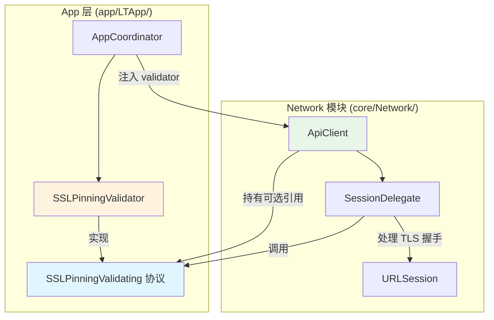
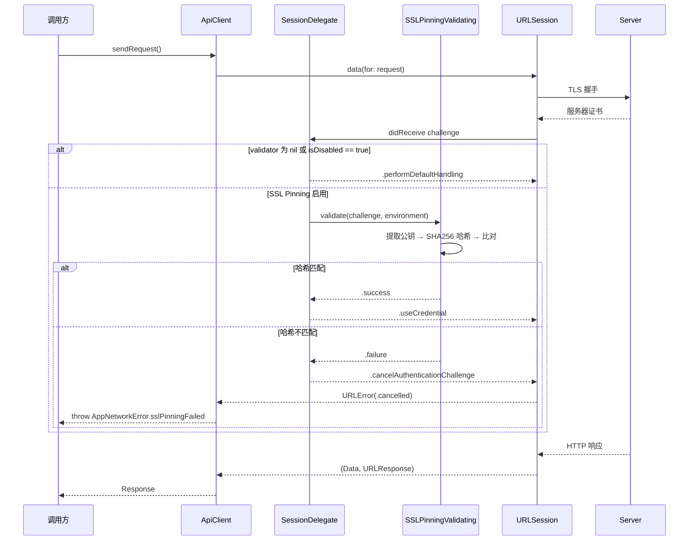

# 技术设计文档：SSL Pinning（公钥证书固定）

## 概述

本设计为 LTNetwork 模块引入 SSL Pinning（公钥证书固定）能力，在 TLS 握手阶段校验服务器公钥的 SHA-256 哈希值，防止中间人攻击。

核心设计原则：
- **协议驱动**：LTNetwork 模块仅定义 `SSLPinningValidating` 协议，不包含任何具体校验逻辑
- **App 层注入**：具体的公钥校验实现（`SSLPinningValidator`）由 App 层提供，通过构造函数注入到 `ApiClient`
- **环境感知**：仅在 `release` 环境启用 SSL Pinning，`dev` 和 `stagging` 环境自动禁用
- **最小侵入**：`ApiClient` 通过可选参数接收校验器，未注入时行为不变

### 设计决策

1. **使用 URLSessionDelegate 而非 Interceptor**：SSL Pinning 发生在 TLS 握手阶段，早于 HTTP 请求/响应周期，因此不适合放在现有的 `NetworkInterceptor` 拦截器链中。`ApiClient` 需要创建一个实现 `URLSessionDelegate` 的内部类来处理 `urlSession(_:didReceive:completionHandler:)` 回调。

2. **协议定义在 Network 模块，实现在 App 层**：遵循 Clean Architecture 的依赖反转原则，Network 模块作为底层模块不依赖 App 层的具体实现。

3. **使用 CryptoKit 进行哈希计算**：Apple 原生框架，无需引入第三方依赖，iOS 13+ 可用。

4. **新增 `sslPinningFailed` 错误类型**：在 `AppNetworkError` 中新增专用 case，使调用方能够区分 SSL Pinning 失败与其他网络错误。

## 架构



### 请求流程



## 组件与接口

### 1. SSLPinningValidating 协议（LTNetwork 模块）

**文件位置**：`core/Network/Source/Model/SSLPinningValidating.swift`

```swift
import Foundation

/// SSL Pinning 校验结果
public enum SSLPinningResult: Sendable {
    case success(URLCredential)
    case failure
    case performDefaultHandling
}

/// SSL Pinning 校验协议，由 App 层提供具体实现
public protocol SSLPinningValidating: Sendable {
    /// 是否禁用 SSL Pinning
    var isDisabled: Bool { get }
    
    /// 预置的公钥 SHA-256 哈希值数组（Base64 编码）
    var pinnedPublicKeyHashes: [String] { get }
    
    /// 根据 URLAuthenticationChallenge 和当前环境执行公钥校验
    func validate(
        challenge: URLAuthenticationChallenge,
        environment: AppEnvironment
    ) -> SSLPinningResult
}
```

### 2. SessionDelegate 内部类（LTNetwork 模块）

**文件位置**：`core/Network/Source/ApiClient.swift`（内部类）

```swift
final class SessionDelegate: NSObject, URLSessionDelegate, @unchecked Sendable {
    private let validator: (any SSLPinningValidating)?
    private let environment: AppEnvironment
    
    init(validator: (any SSLPinningValidating)?, environment: AppEnvironment) {
        self.validator = validator
        self.environment = environment
    }
    
    func urlSession(
        _ session: URLSession,
        didReceive challenge: URLAuthenticationChallenge,
        completionHandler: @escaping (URLSession.AuthChallengeDisposition, URLCredential?) -> Void
    ) {
        guard let validator, !validator.isDisabled else {
            completionHandler(.performDefaultHandling, nil)
            return
        }
        
        let result = validator.validate(challenge: challenge, environment: environment)
        switch result {
        case .success(let credential):
            completionHandler(.useCredential, credential)
        case .failure:
            completionHandler(.cancelAuthenticationChallenge, nil)
        case .performDefaultHandling:
            completionHandler(.performDefaultHandling, nil)
        }
    }
}
```

### 3. ApiClient 修改（LTNetwork 模块）

**文件位置**：`core/Network/Source/ApiClient.swift`

变更点：
- 构造函数新增可选参数 `sslPinningValidator: (any SSLPinningValidating)? = nil`
- 创建 `SessionDelegate` 实例并传入 validator
- 使用 `URLSession(configuration:delegate:delegateQueue:)` 创建 session

```swift
public init(
    configuration: URLSessionConfiguration = .default,
    environment: AppEnvironment,
    interceptors: [NetworkInterceptor],
    sslPinningValidator: (any SSLPinningValidating)? = nil,
    maxRetryCount: Int = 2
) {
    let delegate = SessionDelegate(
        validator: sslPinningValidator,
        environment: environment
    )
    self.session = URLSession(
        configuration: configuration,
        delegate: delegate,
        delegateQueue: nil
    )
    self.environment = environment
    self.interceptors = interceptors
    self.chain = InterceptorChain(interceptors: interceptors)
    self.maxRetryCount = maxRetryCount
}
```

### 4. AppNetworkError 扩展（LTNetwork 模块）

**文件位置**：`core/Network/Source/Model/AppNetworkError.swift`

新增 case：

```swift
case sslPinningFailed
```

在 `ApiClient` 的网络错误处理中，当捕获到 `URLError(.cancelled)` 且 SSL Pinning 启用时，将其转换为 `AppNetworkError.sslPinningFailed`。

### 5. SSLPinningValidator 实现（App 层）

**文件位置**：`app/LTApp/LTApp/Source/Service/Network/SSLPinningValidator.swift`

```swift
import Foundation
import CryptoKit
import LTNetwork

struct SSLPinningValidator: SSLPinningValidating {
    let isDisabled: Bool
    let pinnedPublicKeyHashes: [String]
    
    init(environment: AppEnvironment, pinnedPublicKeyHashes: [String]) {
        self.isDisabled = environment != .release
        self.pinnedPublicKeyHashes = pinnedPublicKeyHashes
    }
    
    func validate(
        challenge: URLAuthenticationChallenge,
        environment: AppEnvironment
    ) -> SSLPinningResult {
        // 1. 仅处理 ServerTrust 类型的质询
        guard challenge.protectionSpace.authenticationMethod 
                == NSURLAuthenticationMethodServerTrust,
              let serverTrust = challenge.protectionSpace.serverTrust
        else {
            return .failure
        }
        
        // 2. 提取服务器证书公钥
        guard let serverCertificate = SecTrustCopyCertificateChain(serverTrust)?.first,
              let publicKey = SecCertificateCopyKey(serverCertificate as! SecCertificate),
              let publicKeyData = SecKeyCopyExternalRepresentation(publicKey, nil) as? Data
        else {
            return .failure
        }
        
        // 3. 使用 CryptoKit SHA256 计算哈希
        let hash = SHA256.hash(data: publicKeyData)
        let hashBase64 = Data(hash).base64EncodedString()
        
        // 4. 比对哈希值
        if pinnedPublicKeyHashes.contains(hashBase64) {
            let credential = URLCredential(trust: serverTrust)
            return .success(credential)
        }
        
        return .failure
    }
}
```

### 6. AppCoordinator 注入

**文件位置**：`app/LTApp/LTApp/Source/Domain/Coordinator/AppCoordinator.swift`

在 `init(environment:)` 中创建 `SSLPinningValidator` 并注入到所有 `ApiClient` 实例：

```swift
let sslPinningValidator = SSLPinningValidator(
    environment: enviroment,
    pinnedPublicKeyHashes: [
        "YOUR_BASE64_ENCODED_SHA256_HASH_HERE"
    ]
)

let interceptorClient = ApiClient(
    environment: enviroment,
    interceptors: [],
    sslPinningValidator: sslPinningValidator
)

// ... 后续的 apiClient 也传入同一个 sslPinningValidator
let apiClient = ApiClient(
    environment: enviroment,
    interceptors: [tokenInterceptor, refreshTokenInterceptor, logoutInterceptor],
    sslPinningValidator: sslPinningValidator
)
```

## 数据模型

### SSLPinningResult

| 值 | 说明 |
|---|---|
| `.success(URLCredential)` | 公钥哈希匹配，使用该凭证继续 TLS 握手 |
| `.failure` | 公钥哈希不匹配或无法提取公钥，取消连接 |
| `.performDefaultHandling` | 使用系统默认证书验证（validator 禁用时） |

### AppNetworkError 新增

| Case | 说明 |
|---|---|
| `.sslPinningFailed` | SSL Pinning 校验失败，服务器公钥哈希与本地预置值不匹配 |

### SSLPinningValidating 协议属性

| 属性/方法 | 类型 | 说明 |
|---|---|---|
| `isDisabled` | `Bool` | 是否禁用 SSL Pinning |
| `pinnedPublicKeyHashes` | `[String]` | 预置的公钥 SHA-256 哈希值（Base64 编码） |
| `validate(challenge:environment:)` | `SSLPinningResult` | 执行公钥校验 |


## 正确性属性（Correctness Properties）

*属性（Property）是指在系统所有合法执行路径中都应成立的特征或行为——本质上是对系统行为的形式化陈述。属性是连接人类可读规格说明与机器可验证正确性保证之间的桥梁。*

### Property 1: 哈希成员关系决定校验结果

*For any* 计算得到的公钥哈希字符串和任意预置哈希数组，当该哈希字符串存在于数组中时校验应返回成功，当该哈希字符串不存在于数组中时校验应返回失败。

**Validates: Requirements 3.3, 3.4, 3.5**

### Property 2: 环境决定禁用状态

*For any* `AppEnvironment` 值，`SSLPinningValidator` 的 `isDisabled` 属性应等于 `environment != .release`。即仅当环境为 `.release` 时 `isDisabled` 为 `false`，其余环境均为 `true`。

**Validates: Requirements 4.1, 4.2, 4.3**

## 错误处理

| 场景 | 处理方式 |
|---|---|
| SSL Pinning 校验失败（哈希不匹配） | `SessionDelegate` 调用 `.cancelAuthenticationChallenge`，`ApiClient` 捕获 `URLError` 并转换为 `AppNetworkError.sslPinningFailed` |
| 无法从证书中提取公钥 | `validate()` 返回 `.failure`，连接被取消 |
| 认证方法非 `NSURLAuthenticationMethodServerTrust` | `validate()` 返回 `.failure`，连接被取消 |
| `SSLPinningValidating` 未注入（nil） | `SessionDelegate` 调用 `.performDefaultHandling`，使用系统默认证书验证 |
| `isDisabled` 为 `true` | `SessionDelegate` 调用 `.performDefaultHandling`，跳过 SSL Pinning |
| 证书链为空 | `validate()` 无法获取 `SecCertificate`，返回 `.failure` |

### 错误转换逻辑

在 `ApiClient.executeWithRetry` 的网络错误捕获中，需要增加对 SSL Pinning 失败的识别：

```swift
do {
    responseData = try await session.data(for: urlRequest)
} catch {
    if error is CancellationError { throw error }
    // 当 SSL Pinning 启用且收到 cancelled 错误时，判定为 SSL Pinning 失败
    if let urlError = error as? URLError,
       urlError.code == .cancelled,
       let validator = sslPinningValidator,
       !validator.isDisabled {
        throw AppNetworkError.sslPinningFailed
    }
    throw AppNetworkError.networkError(
        debugDescription: error.localizedDescription,
        errorCode: (error as? URLError)?.code
    )
}
```

## 测试策略

### 属性测试（Property-Based Testing）

使用 [swift-custom-dump](https://github.com/pointfreeco/swift-custom-dump) 配合 XCTest 进行属性测试，或使用 SwiftCheck 库。由于项目当前使用 XCTest，建议在 `LTNetworkTests` 中通过循环随机生成输入来模拟属性测试。

**配置要求**：
- 每个属性测试最少运行 100 次迭代
- 每个测试需注释引用对应的设计属性
- 标签格式：`Feature: ssl-pinning, Property {number}: {property_text}`

**Property 1 测试**：哈希成员关系决定校验结果
- 生成随机哈希字符串和随机哈希数组
- 当哈希在数组中时，验证比对逻辑返回匹配
- 当哈希不在数组中时，验证比对逻辑返回不匹配
- 覆盖边界情况：空数组、单元素数组、大量元素数组

**Property 2 测试**：环境决定禁用状态
- 遍历所有 `AppEnvironment` 值（`.dev`, `.stagging`, `.release`）
- 验证 `isDisabled` 与 `environment != .release` 一致

### 单元测试

| 测试场景 | 验证内容 |
|---|---|
| SessionDelegate - validator 为 nil | 调用 `.performDefaultHandling` |
| SessionDelegate - validator.isDisabled == true | 调用 `.performDefaultHandling` |
| SessionDelegate - 校验成功 | 调用 `.useCredential` |
| SessionDelegate - 校验失败 | 调用 `.cancelAuthenticationChallenge` |
| SSLPinningValidator - 非 ServerTrust 质询 | 返回 `.failure` |
| SSLPinningValidator - 无法提取公钥 | 返回 `.failure` |
| ApiClient 构造 - 带 validator | 正常创建，session 使用自定义 delegate |
| ApiClient 构造 - 不带 validator | 正常创建，行为与现有一致 |

### 集成测试

| 测试场景 | 验证内容 |
|---|---|
| 完整 TLS 握手 - 哈希匹配 | 请求成功完成 |
| 完整 TLS 握手 - 哈希不匹配 | 抛出 `AppNetworkError.sslPinningFailed` |
| AppCoordinator 注入 | 两个 ApiClient 实例均持有同一 validator |

### 测试文件位置

- 属性测试和单元测试：`core/Network/Tests/SSLPinningTests.swift`
- App 层实现测试：`app/LTApp/LTApp/Tests/SSLPinningValidatorTests.swift`（如有测试 target）
