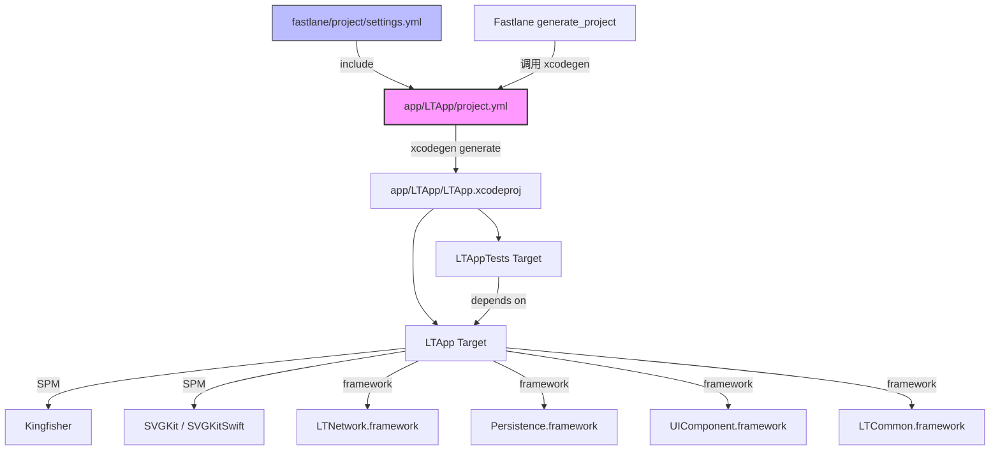

# Design Document: XcodeGen 项目迁移

## Overview

本设计文档描述将 `app/LTApp/LTApp.xcodeproj` 从手动维护迁移为 XcodeGen 自动生成的完整方案。迁移后，开发者通过编辑 `app/LTApp/project.yml` 管理项目配置，运行 XcodeGen 即可生成与现有项目完全一致的 `.xcodeproj` 文件。

### 设计目标

1. **配置等价性**：生成的 `.xcodeproj` 在 targets、build settings、dependencies、schemes 等方面与现有项目完全一致
2. **风格一致性**：与 `core/` 下已有模块（Network、Persistence、Common、UIComponent）的 `project.yml` 保持统一的配置风格
3. **CI/CD 兼容性**：Fastlane 的 `generate_project` lane 能正确生成 LTApp 项目
4. **版本控制优化**：`.xcodeproj` 不再纳入 Git 管理，仅保留 `project.yml` 源文件

### 关键设计决策

| 决策 | 选择 | 理由 |
|------|------|------|
| settings.yml 复用 | 通过 `include` 引用共享配置 | 与 core 模块保持一致，避免重复定义 |
| Release-Debug 配置 | 在 project.yml 中新增 configs 映射 | settings.yml 仅定义 Debug/Release，需在 LTApp 层扩展 |
| Core 框架依赖方式 | 使用 `framework` 类型引用 | LTApp 需要 embed + code sign，与 pbxproj 中的配置一致 |
| SPM 依赖声明 | 在 project.yml 的 `packages` 节点声明 | XcodeGen 原生支持 SPM 包管理 |
| Scheme 定义 | 直接定义而非使用模板 | LTApp 的 scheme 比 core 模块更复杂，需要自定义 test target 和 code coverage |

## Architecture

### 迁移架构总览



### 文件结构

```
app/LTApp/
├── project.yml                    # 新增：XcodeGen 配置文件
├── LTApp.xcodeproj/              # 由 XcodeGen 生成（不纳入 Git）
├── LTApp/
│   ├── Source/                    # 源代码目录
│   │   └── Domain/Thread/test_rocket.png  # 需作为资源引入
│   ├── Resource/
│   │   ├── Assets.xcassets        # 资源目录
│   │   ├── LaunchScreen.storyboard
│   │   ├── Info.plist
│   │   └── LTApp.entitlements
│   └── Tests/
│       └── LTAppTests.swift       # 单元测试
fastlane/
├── project/
│   └── settings.yml               # 共享构建配置（已有）
├── Fastfile                       # 需更新 generate_project lane
.gitignore                         # 需更新忽略规则
```

## Components and Interfaces

### 1. project.yml 配置文件

`app/LTApp/project.yml` 是本次迁移的核心产物，定义了完整的项目配置。

#### 1.1 项目级配置

```yaml
---
include:
  - ../../fastlane/project/settings.yml

name: LTApp

configs:
  Debug: debug
  Release: release
  Release-Debug: release

options:
  defaultConfig: Debug

settings:
  groups:
    - BaseProjectSetting
  configs:
    Release-Debug:
      SWIFT_OPTIMIZATION_LEVEL: "-Onone"
      OTHER_SWIFT_FLAGS: "-DDEBUG"
```

**设计说明**：
- `include` 引用共享 `settings.yml`，与 core 模块保持一致
- `configs` 节点覆盖 `settings.yml` 中仅有的 Debug/Release 定义，新增 Release-Debug 配置
- Release-Debug 映射为 `release` 类型，但通过 project-level settings 覆盖优化级别为 `-Onone` 并添加 `-DDEBUG` 标志
- `defaultConfig` 设为 Debug

#### 1.2 LTApp Target 配置

```yaml
targets:
  LTApp:
    type: application
    platform: iOS
    sources:
      - LTApp/Source
    resources:
      - LTApp/Resource/Assets.xcassets
      - LTApp/Resource/LaunchScreen.storyboard
      - LTApp/Resource/Info.plist
      - LTApp/Source/Domain/Thread/test_rocket.png
    settings:
      groups:
        - BaseTargetSetting
      base:
        PRODUCT_BUNDLE_IDENTIFIER: com.little.things
        PRODUCT_NAME: LTApp
        SWIFT_VERSION: "6.0"
        IPHONE_DEPLOYMENT_TARGET: "18.0"
        INFOPLIST_FILE: LTApp/Resource/Info.plist
        CODE_SIGN_ENTITLEMENTS: LTApp/Resource/LTApp.entitlements
        CODE_SIGN_STYLE: Manual
        DEVELOPMENT_TEAM: R7S4TKW9JF
        SUPPORTED_PLATFORMS: "iphoneos iphonesimulator"
        TARGETED_DEVICE_FAMILY: "1,2"
        SUPPORTS_MACCATALYST: "NO"
        SUPPORTS_MAC_DESIGNED_FOR_IPHONE_IPAD: "YES"
        SUPPORTS_XR_DESIGNED_FOR_IPHONE_IPAD: "YES"
      configs:
        Debug:
          CODE_SIGN_IDENTITY: "Apple Development"
          PROVISIONING_PROFILE_SPECIFIER: little.things.dev.profile
        Release:
          CODE_SIGN_IDENTITY: "iPhone Distribution: Shanghai Weishu Weixiang Network Technology Co., Ltd. (R7S4TKW9JF)"
          PROVISIONING_PROFILE_SPECIFIER: little.things.adhoc.profile
        Release-Debug:
          CODE_SIGN_IDENTITY: "iPhone Distribution: Shanghai Weishu Weixiang Network Technology Co., Ltd. (R7S4TKW9JF)"
          PROVISIONING_PROFILE_SPECIFIER: little.things.adhoc.profile
    dependencies:
      - package: Kingfisher
      - package: SVGKit
        product: SVGKit
      - package: SVGKit
        product: SVGKitSwift
      - framework: ../../core/Network/build/Build/Products/Debug-iphonesimulator/LTNetwork.framework
        embed: true
        codeSign: true
      - framework: ../../core/Persistence/build/Build/Products/Debug-iphonesimulator/Persistence.framework
        embed: true
        codeSign: true
      - framework: ../../core/UIComponent/build/Build/Products/Debug-iphonesimulator/UIComponent.framework
        embed: true
        codeSign: true
      - framework: ../../core/Common/build/Build/Products/Debug-iphonesimulator/LTCommon.framework
        embed: true
        codeSign: true
```

**设计说明**：
- `sources` 指向 `LTApp/Source`，XcodeGen 会递归包含该目录下所有 Swift 文件
- `resources` 显式列出资源文件，包括 `test_rocket.png`（位于 Source 目录下但需作为资源处理）
- `settings.base` 包含所有配置通用的 build settings
- `settings.configs` 按配置分别设置代码签名相关参数
- Core 框架依赖使用 `framework` 类型，设置 `embed: true` 和 `codeSign: true` 以匹配现有 "Embed Frameworks" build phase

> **注意**：Core 框架的路径需要根据实际构建产物位置调整。如果 core 模块通过 workspace 或其他方式集成，可能需要使用不同的依赖引用方式（如 `target` 引用或 Carthage 风格的路径）。这一点需要在实施时验证。

#### 1.3 LTAppTests Target 配置

```yaml
  LTAppTests:
    type: bundle.unit-test
    platform: iOS
    sources:
      - LTApp/Tests
    dependencies:
      - target: LTApp
    settings:
      base:
        GENERATE_INFOPLIST_FILE: true
        PRODUCT_BUNDLE_IDENTIFIER: com.LTAppTests
```

**设计说明**：
- 测试 target 依赖 LTApp target，XcodeGen 会自动设置 `TEST_HOST` 和 `BUNDLE_LOADER`
- 使用 `GENERATE_INFOPLIST_FILE: true` 让 Xcode 自动生成 Info.plist

#### 1.4 SPM 包声明

```yaml
packages:
  Kingfisher:
    url: https://github.com/onevcat/Kingfisher
    from: "8.6.2"
  SVGKit:
    url: https://github.com/SVGKit/SVGKit
    from: "3.0.0"
```

**设计说明**：
- `from` 对应 `upToNextMajor` 版本策略
- SVGKit 包含两个 product（SVGKit 和 SVGKitSwift），在 target dependencies 中分别引用

#### 1.5 Scheme 配置

```yaml
schemes:
  LTApp:
    build:
      targets:
        LTApp: all
    test:
      targets:
        - name: LTAppTests
          randomExecutionOrder: false
      gatherCoverageData: true
```

**设计说明**：
- 直接定义 scheme 而非使用 `SchemeTemplates`，因为 LTApp 的 scheme 需求与 core 模块不同（application vs framework）
- 启用 code coverage 收集

### 2. Fastlane 更新

#### 2.1 generate_project lane 修改

当前 `generate_project` lane 仅生成 `fastlane/project/project.yml` 对应的项目。需要扩展为同时生成 LTApp 项目：

```ruby
lane :generate_project do
  sh("xcodegen generate -s project/project.yml")
  sh("xcodegen generate -s ../app/LTApp/project.yml --project ../app/LTApp")
end
```

**设计说明**：
- 新增一行 xcodegen 命令，指定 LTApp 的 `project.yml` 路径
- `--project` 参数指定生成的 `.xcodeproj` 输出目录为 `app/LTApp/`
- 保留原有的 core 模块项目生成命令

#### 2.2 internal_test lane

`internal_test` lane 中的 `build_app` 使用 `project: 'LTApp.xcodeproj'`，由于 `.xcodeproj` 的生成位置不变（仍在 `app/LTApp/` 目录），该 lane 无需修改。

### 3. .gitignore 更新

在 `.gitignore` 中添加规则，忽略 XcodeGen 生成的 `.xcodeproj` 文件：

```gitignore
# XcodeGen generated project files
*.xcodeproj
```

**设计说明**：
- 使用通配符 `*.xcodeproj` 忽略所有 XcodeGen 生成的项目文件
- 保留已有的 `xcuserdata/` 忽略规则
- 现有 `.gitignore` 中已有被注释掉的 `# *.xcodeproj` 行，取消注释即可

## Data Models

本次迁移不涉及应用层数据模型变更。核心数据模型为 `project.yml` 的 YAML 结构，其 schema 由 XcodeGen 定义。

### project.yml 关键结构

| 节点 | 类型 | 说明 |
|------|------|------|
| `include` | `[String]` | 引用的外部配置文件路径 |
| `name` | `String` | 项目名称 |
| `configs` | `{String: String}` | 构建配置名称到类型的映射 |
| `options` | `Object` | 项目选项（defaultConfig 等） |
| `settings` | `Object` | 项目级 build settings |
| `packages` | `{String: Object}` | SPM 包声明 |
| `targets` | `{String: Object}` | Target 定义 |
| `schemes` | `{String: Object}` | Scheme 定义 |

### Build Configuration 映射

| 配置名称 | XcodeGen 类型 | 优化级别 | 特殊标志 |
|----------|--------------|---------|---------|
| Debug | `debug` | 默认（-Onone） | 默认 DEBUG 标志 |
| Release | `release` | -O（默认 release） | 无 |
| Release-Debug | `release` | -Onone（覆盖） | -DDEBUG |

## Error Handling

### 迁移过程中的潜在问题及应对

| 问题场景 | 影响 | 应对策略 |
|----------|------|---------|
| XcodeGen 版本不兼容 | 生成失败或配置不正确 | settings.yml 已指定 `minimumXcodeGenVersion: 2.44.1`，确保团队使用兼容版本 |
| Core 框架路径不正确 | 链接失败 | 实施时验证框架路径，必要时调整为相对路径或使用 workspace 集成 |
| settings.yml 中缺少 Release-Debug 配置 | XcodeGen 可能报错或忽略 | 在 project.yml 中显式定义 `configs` 节点覆盖 settings.yml |
| SPM 包版本解析失败 | 依赖下载失败 | 确保版本号与现有 `Package.resolved` 一致 |
| .gitignore 规则过于宽泛 | 误忽略非 XcodeGen 管理的 xcodeproj | 当前项目中所有 xcodeproj 均由 XcodeGen 管理，`*.xcodeproj` 规则是安全的 |
| 资源文件遗漏 | 运行时找不到资源 | 在 `resources` 节点显式列出所有资源文件，生成后对比文件引用 |

### 回滚方案

如果迁移后发现问题：
1. 从 Git 历史恢复 `LTApp.xcodeproj`
2. 从 `.gitignore` 移除 `*.xcodeproj` 规则
3. 从 Fastlane 移除 LTApp 的 xcodegen 命令

## Testing Strategy

### 为什么不使用 Property-Based Testing

本次迁移属于 **Infrastructure as Code (IaC)** 类型的变更——创建声明式配置文件（YAML）并更新 CI/CD 脚本。这不涉及具有输入/输出行为的函数或业务逻辑，因此 property-based testing 不适用。适合的测试策略是验证性测试和集成测试。

### 测试方案

#### 1. YAML 语法验证（Smoke Test）

验证 `project.yml` 是合法的 YAML 文件且符合 XcodeGen schema：

```bash
xcodegen generate -s app/LTApp/project.yml --project app/LTApp/ --dry-run
```

- 如果 XcodeGen 不支持 `--dry-run`，直接运行生成命令并检查退出码

#### 2. 项目生成验证（Integration Test）

运行 XcodeGen 生成 `.xcodeproj`，验证生成成功：

```bash
cd app/LTApp && xcodegen generate
```

- 验证 `LTApp.xcodeproj` 目录被创建
- 验证 `project.pbxproj` 文件存在

#### 3. Build Settings 对比验证（Integration Test）

使用 `xcodebuild` 提取生成项目的 build settings，与预期值对比：

```bash
xcodebuild -project app/LTApp/LTApp.xcodeproj -target LTApp -configuration Debug -showBuildSettings
```

关键验证项：
- `PRODUCT_BUNDLE_IDENTIFIER` = `com.little.things`
- `SWIFT_VERSION` = `6.0`
- `CODE_SIGN_STYLE` = `Manual`
- `DEVELOPMENT_TEAM` = `R7S4TKW9JF`
- 各配置下的 `CODE_SIGN_IDENTITY` 和 `PROVISIONING_PROFILE_SPECIFIER`

#### 4. 构建验证（Integration Test）

验证生成的项目能成功编译：

```bash
xcodebuild -project app/LTApp/LTApp.xcodeproj -scheme LTApp -configuration Debug -destination 'platform=iOS Simulator,name=iPhone 16' build
```

#### 5. Fastlane 集成验证（Integration Test）

验证 `generate_project` lane 能正确执行：

```bash
cd fastlane && bundle exec fastlane generate_project
```

- 验证 LTApp.xcodeproj 被正确生成
- 验证后续 `internal_test` lane 能正常工作

#### 6. 手动验证清单

- [ ] 在 Xcode 中打开生成的项目，确认 target 列表正确
- [ ] 确认 LTApp scheme 可见且可选择
- [ ] 确认 SPM 依赖能正确解析和下载
- [ ] 确认 Core 框架能正确链接
- [ ] 确认 Debug/Release/Release-Debug 三种配置都能构建
- [ ] 确认单元测试能运行
- [ ] 确认 Fastlane `internal_test` 能完整执行
