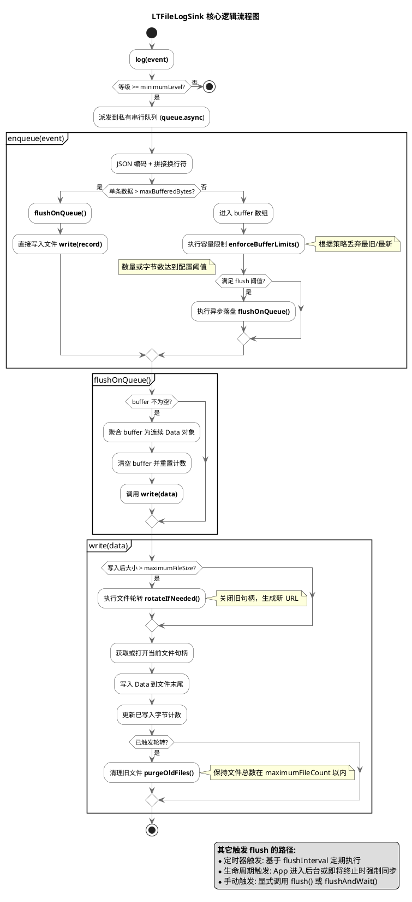

# LTLog 技术文档

`LTLog` 是 Common 模块内的 iOS 日志组件。组件以 Apple Unified Logging / `OSLog.Logger` 为底层默认实现，同时提供文件日志、用户反馈日志导出、远程日志、breadcrumb、采样和限流能力。

该组件是通用日志 framework，不内置业务模块概念。业务模块通过自定义 `category` 接入，例如 `payment`、`sync`、`profile`，但这些 category 不属于日志组件本身的固定 API。

## 设计目标

- 统一 App 内日志接入方式。
- 保留 `OSLogMessage` 的隐私插值能力。
- 支持按 `subsystem + category` 在 Console.app 中检索。
- 支持用户反馈场景下导出最近日志。
- 支持远程日志上报。
- 支持 breadcrumb 记录关键操作轨迹。
- 支持采样和限流，避免线上日志造成性能、流量或成本问题。
- 保持日志组件与业务模块解耦。

## 架构

```text
Business Module
    -> LTLog.logger(category:)
        -> LTLogger
            -> OSLog.Logger
            -> LTLogStore
                -> LTBreadcrumbStore
                -> LTFileLogSink
                -> LTRemoteLogSink
                -> LTTestLogSink
```

`OSLog.Logger` 是系统日志主路径。`LTLogSink` 是扩展路径，用于文件日志、远程日志和测试。

## 快速接入

在 App 启动阶段配置一次：

```swift
import Common

let fileSink = LTFileLogSink()

LTLog.configure(.init(
    subsystem: Bundle.main.bundleIdentifier ?? "com.company.app",
    minimumLevel: .info,
    environment: .production,
    sinks: [fileSink]
))
```

业务模块创建自己的 logger：

```swift
import Common

enum PaymentLog {
    static let logger = LTLog.logger(category: "payment")
}
```

记录系统日志：

```swift
let orderId = "order-001"
let statusCode = 200

PaymentLog.logger.info("Payment finished status=\(statusCode, privacy: .public)")
PaymentLog.logger.error("Payment failed orderId=\(orderId, privacy: .private(mask: .hash))")
```

如果当前日志内容已经确认可以明文展示，并且希望避开 `OSLogMessage` 插值的编辑器诊断噪音，可以使用 `public` 字符串入口：

```swift
PaymentLog.logger.info(public: "Payment finished status=\(statusCode)")
```

需要进入文件日志、远程日志或用户反馈导出的日志，使用 `exportable` 入口：

```swift
PaymentLog.logger.warning(
    exportable: "Payment retry",
    metadata: [
        "requestId": requestId,
        "retryCount": "\(retryCount)"
    ]
)
```

## 三类日志入口

### OSLogMessage 入口

```swift
logger.info("userId=\(userId, privacy: .private(mask: .hash))")
logger.error("statusCode=\(statusCode, privacy: .public)")
```

这类入口保留 Apple `OSLogMessage` 的编译器优化和隐私能力，适合绝大多数诊断日志。

注意：`OSLogMessage` 无法被安全、完整地转换为普通 `String`。因此这类日志会写入系统日志，但不会带着原始文本进入 file sink 或 remote sink。

### Public String 入口

```swift
logger.info(public: "screen=\(screenName)")
logger.warning(public: "retryCount=\(retryCount)")
```

这类入口接收普通 `String`，并把整条消息作为 `.public` 内容写入 `OSLog.Logger`。它适合非敏感、临时诊断或不需要 `OSLogMessage` privacy 插值的场景，也能避开部分 Xcode SourceKit 对 `OSLogMessage` facade 的误报。

注意：`public` 入口不会生成带 `message` 的 `LTLogEvent`，默认不会进入 file sink、remote sink 或用户反馈导出。需要导出的日志仍然使用 `exportable` 入口。

### Exportable 入口

```swift
logger.info(
    exportable: "Sync finished",
    metadata: ["durationMs": "\(durationMs)"]
)
```

这类入口会：

- 写入 `OSLog.Logger`。
- 生成带 `message` 和 `metadata` 的 `LTLogEvent`。
- 分发给 file sink、remote sink、test sink。
- 可被用户反馈日志导出。
- 可进入 breadcrumb，取决于 breadcrumb 配置。

使用要求：`exportable` 内容必须已经完成脱敏。不要写入 token、cookie、手机号、邮箱、完整定位、完整请求体、完整响应体等敏感信息。

## 全局配置

```swift
LTLog.configure(.init(
    subsystem: Bundle.main.bundleIdentifier ?? "com.company.app",
    minimumLevel: .info,
    environment: .production,
    sinks: [
        LTFileLogSink(),
        remoteSink
    ],
    breadcrumbConfiguration: .init(
        isEnabled: true,
        capacity: 100,
        minimumLevel: .notice
    ),
    samplingPolicy: .init(
        rate: 1,
        alwaysRecordAtOrAbove: .error
    ),
    rateLimitPolicy: .init(
        maxEvents: 300,
        interval: 60
    )
))
```

字段说明：

| 字段 | 说明 |
| --- | --- |
| `subsystem` | 推荐使用宿主 App 的 bundle identifier。 |
| `minimumLevel` | 全局最低日志等级。低于该等级不会进入 OSLog 和 sink 管道。 |
| `environment` | 当前环境：`debug`、`staging`、`production`。 |
| `sinks` | 扩展输出目标，如 file、remote、test。 |
| `breadcrumbConfiguration` | breadcrumb 开关、容量和最低等级。 |
| `samplingPolicy` | 全局 sink 管道采样策略。 |
| `rateLimitPolicy` | 全局 sink 管道限流策略。 |

运行时可以调整最低等级：

```swift
LTLog.setMinimumLevel(.warning)
```

也可以追加或移除 sink：

```swift
LTLog.addSink(LTFileLogSink())
LTLog.removeAllSinks()
```

## 日志等级

`LTLogLevel` 支持：

```text
trace
debug
info
notice
warning
error
fault
```

OSLog 映射：

| LTLogLevel | OSLog |
| --- | --- |
| `trace` | `.debug` |
| `debug` | `.debug` |
| `info` | `.info` |
| `notice` | `.default` |
| `warning` | `.error` |
| `error` | `.error` |
| `fault` | `.fault` |

建议线上配置：

```swift
minimumLevel: .info
```

远程日志建议：

```swift
minimumLevel: .warning
```

## 文件日志

文件日志由 `LTFileLogSink` 提供，格式为 JSON Lines，一行一个 `LTLogEvent`。

```swift
let fileSink = LTFileLogSink(configuration: .init(
    directoryURL: LTFileLogConfiguration.defaultDirectoryURL(),
    filePrefix: "lt-log",
    maximumFileSize: 1024 * 1024,
    maximumFileCount: 5,
    minimumLevel: .notice,
    includeNonExportableEvents: false,
    flushInterval: 5,
    flushEventCount: 20,
    flushByteCount: 64 * 1024,
    maximumBufferedEventCount: 500,
    maximumBufferedBytes: 512 * 1024,
    overflowStrategy: .dropOldest
))
```

默认行为：

- 写入 Caches 目录下的 `LTLogs`。
- 单文件最大 1 MB。
- 最多保留 5 个日志文件。
- 只记录 `notice` 及以上等级。
- 默认只记录 `exportable` 日志。
- 日志先进入内存 buffer，不会每条日志都打开文件写入。
- 满 20 条、满 64 KB、或每 5 秒自动批量 flush。
- buffer 最多保留 500 条或 512 KB，超过后默认丢弃最旧记录。
- App 进入后台、即将终止、用户反馈导出前会强制 flush。
- 文件 sink 持有当前日志文件的 `FileHandle`，rotation 使用累计写入字节数判断，避免每条日志查询文件属性。

### 内部逻辑流程




`includeNonExportableEvents` 设为 `true` 时，普通 `OSLogMessage` 入口也会生成文件事件，但这类事件没有 `message` 文本，只包含等级、category、环境、文件名、函数名、行号等元信息。

手动 flush：

```swift
fileSink.flush()
fileSink.flushAndWait()
```

`flush()` 是异步落盘；`flushAndWait()` 会等待当前 buffer 写完，适合用户反馈导出前、调试验证或 App 生命周期收尾场景。全局 `LTLog.exportFeedbackLogs()` 会通过 `logFileURLs()` 自动触发 file sink flush。

## 用户反馈日志导出

全局导出：

```swift
let fileURL = try LTLog.exportFeedbackLogs()
```

不包含 breadcrumbs：

```swift
let fileURL = try LTLog.exportFeedbackLogs(includeBreadcrumbs: false)
```

单个 file sink 导出：

```swift
let fileURL = try fileSink.exportFeedbackLogs(
    breadcrumbs: LTLog.breadcrumbs
)
```

导出文件为 JSON Lines：

- file sink 中已有的 `LTLogEvent`。
- 可选的 `LTBreadcrumb` 记录。

注意：导出日志前仍然需要产品或业务层确认用户授权策略。日志组件只负责生成文件，不负责 UI 授权流程。

## Remote Sink

远程日志由 `LTRemoteLogSink` 提供。

```swift
let transport = LTURLSessionRemoteLogTransport(
    endpointURL: URL(string: "https://api.example.com/mobile/logs")!,
    headers: [
        "X-App-Version": appVersion
    ]
)

let remoteSink = LTRemoteLogSink(
    configuration: .init(
        minimumLevel: .warning,
        batchSize: 20,
        flushInterval: 15,
        maximumBufferSize: 200,
        sendsExportableEventsOnly: true,
        samplingPolicy: .init(rate: 0.2, alwaysRecordAtOrAbove: .error),
        rateLimitPolicy: .init(maxEvents: 60, interval: 60)
    ),
    transport: transport
)
```

配置说明：

| 字段 | 说明 |
| --- | --- |
| `minimumLevel` | 远程上报最低等级。 |
| `batchSize` | 满多少条立即 flush。 |
| `flushInterval` | 定时 flush 间隔。 |
| `maximumBufferSize` | 本地内存 buffer 上限，超出后丢弃最旧事件。 |
| `sendsExportableEventsOnly` | 默认只发送带 `message` 的 exportable 事件。 |
| `samplingPolicy` | remote sink 独立采样策略。 |
| `rateLimitPolicy` | remote sink 独立限流策略。 |

自定义传输层：

```swift
final class MyRemoteTransport: LTRemoteLogTransport {
    func send(
        _ events: [LTLogEvent],
        completion: @escaping @Sendable (Bool) -> Void
    ) {
        // Encode and send with your own network stack.
        completion(true)
    }
}
```

手动 flush：

```swift
remoteSink.flush()
remoteSink.flushAndWait()
```

`flushAndWait()` 适合测试或生命周期收尾场景，不建议在主线程高频调用。

## Breadcrumb

breadcrumb 用于记录关键路径，帮助定位崩溃或用户反馈前发生了什么。

全局配置：

```swift
breadcrumbConfiguration: .init(
    isEnabled: true,
    capacity: 100,
    minimumLevel: .notice
)
```

手动添加：

```swift
LTLog.addBreadcrumb(
    "User tapped pay",
    category: "payment",
    metadata: ["screen": "Checkout"]
)
```

读取和清空：

```swift
let breadcrumbs = LTLog.breadcrumbs
LTLog.removeAllBreadcrumbs()
```

由日志自动进入 breadcrumb：

```swift
logger.notice(exportable: "Checkout opened")
logger.error(exportable: "Payment failed", metadata: ["code": code])
```

是否自动进入 breadcrumb 取决于 `LTBreadcrumbConfiguration.minimumLevel`。

## 采样

采样策略由 `LTLogSamplingPolicy` 表示。

```swift
LTLogSamplingPolicy(rate: 0.1, alwaysRecordAtOrAbove: .error)
```

含义：

- `rate: 0.1` 表示普通事件按 10% 概率进入 sink 管道。
- `alwaysRecordAtOrAbove: .error` 表示 `error` 和 `fault` 不采样，始终记录。

内置策略：

```swift
LTLogSamplingPolicy.always
LTLogSamplingPolicy.disabled
```

全局采样影响所有 sink。`LTRemoteLogSink` 还可以配置自己的采样策略，适合远程上报单独降采样。

## 限流

限流策略由 `LTLogRateLimitPolicy` 表示。

```swift
LTLogRateLimitPolicy(maxEvents: 300, interval: 60)
```

含义：60 秒窗口内最多允许 300 条事件进入 sink 管道。

内置策略：

```swift
LTLogRateLimitPolicy.disabled
```

全局限流影响所有 sink。`LTRemoteLogSink` 还可以配置自己的限流策略。

## 测试

`LTTestLogSink` 可用于单元测试。

```swift
let sink = LTTestLogSink()

LTLog.configure(.init(
    subsystem: "com.example.tests",
    minimumLevel: .debug,
    environment: .debug,
    sinks: [sink]
))

let logger = LTLog.logger(category: "sync")
logger.error(exportable: "Sync failed", metadata: ["code": "timeout"])

let events = sink.events
```

测试建议：

- 验证 `category` 是否正确。
- 验证 `level` 是否正确。
- 验证 `minimumLevel` 是否生效。
- 验证 exportable 日志是否带 `message` 和 `metadata`。
- 验证普通 OSLog 日志不会误导出敏感文本。

## 事件数据结构

`LTLogEvent` 可编码为 JSON：

```swift
public struct LTLogEvent: Codable, Sendable, Equatable {
    public let level: LTLogLevel
    public let subsystem: String
    public let category: String
    public let environment: LTLogEnvironment
    public let timestamp: Date
    public let message: String?
    public let metadata: [String: String]
    public let file: String
    public let function: String
    public let line: UInt
}
```

示例 JSONL：

```json
{"level":4,"subsystem":"com.company.app","category":"payment","environment":"production","timestamp":"2026-04-30T09:00:00Z","message":"Payment retry","metadata":{"requestId":"req-001"},"file":"PaymentService.swift","function":"pay()","line":42}
```

`level` 当前按 enum raw value 编码：

```text
trace=0, debug=1, info=2, notice=3, warning=4, error=5, fault=6
```

## 隐私规范

普通 OSLog 日志优先使用 privacy 插值：

```swift
logger.info("userId=\(userId, privacy: .private(mask: .hash))")
logger.info("statusCode=\(statusCode, privacy: .public)")
```

已确认可明文展示的普通字符串可以使用 `public` 入口：

```swift
logger.info(public: "statusCode=\(statusCode)")
```

Exportable 日志需要业务方自行保证内容已脱敏：

```swift
logger.error(
    exportable: "Login failed",
    metadata: [
        "statusCode": "\(statusCode)",
        "userIdHash": userIdHash
    ]
)
```

禁止写入：

- token、cookie、authorization header。
- 手机号、邮箱、身份证号。
- 精确定位。
- 完整 URL query。
- 完整 request body / response body。
- 原始用户输入的大段文本。
- 任何无法确认合规性的第三方 SDK 返回内容。

网络日志建议只记录：

```text
method
path
statusCode
duration
requestId
errorCode
retryCount
```

## 推荐配置

Debug：

```swift
LTLog.configure(.init(
    minimumLevel: .debug,
    environment: .debug,
    sinks: [
        LTFileLogSink(configuration: .init(minimumLevel: .debug))
    ],
    breadcrumbConfiguration: .init(capacity: 200, minimumLevel: .debug),
    samplingPolicy: .always,
    rateLimitPolicy: .disabled
))
```

Production：

```swift
LTLog.configure(.init(
    minimumLevel: .info,
    environment: .production,
    sinks: [
        LTFileLogSink(configuration: .init(minimumLevel: .notice)),
        remoteSink
    ],
    breadcrumbConfiguration: .init(capacity: 100, minimumLevel: .notice),
    samplingPolicy: .init(rate: 1, alwaysRecordAtOrAbove: .error),
    rateLimitPolicy: .init(maxEvents: 300, interval: 60)
))
```

Remote：

```swift
LTRemoteLogSink(
    configuration: .init(
        minimumLevel: .warning,
        batchSize: 20,
        flushInterval: 15,
        maximumBufferSize: 200,
        sendsExportableEventsOnly: true,
        samplingPolicy: .init(rate: 0.2, alwaysRecordAtOrAbove: .error),
        rateLimitPolicy: .init(maxEvents: 60, interval: 60)
    ),
    transport: transport
)
```

## 已知边界

- `OSLogMessage` 文本不会被反解析成普通字符串。
- File sink 和 remote sink 默认只处理 `exportable` 日志。
- 组件不负责用户授权 UI。
- 组件不负责日志上传的业务鉴权策略。
- 组件不替代埋点系统。
- 组件不替代 crash 系统。
- 组件不对敏感字段做自动识别和脱敏，业务方必须在写入前处理。

## 接入 checklist

- App 启动阶段调用一次 `LTLog.configure`。
- `subsystem` 使用宿主 App 的 bundle identifier。
- 每个业务模块自行定义自己的 `category`。
- 普通诊断日志使用 `OSLogMessage` 入口。
- 已确认可明文展示且不需要导出的诊断日志，可以使用 `public` 字符串入口。
- 需要导出的日志使用 `exportable` 入口。
- 线上 remote sink 最低等级不低于 `.warning`。
- 线上 remote sink 开启采样和限流。
- 用户反馈导出前完成用户授权。
- 所有 exportable 内容经过脱敏。
